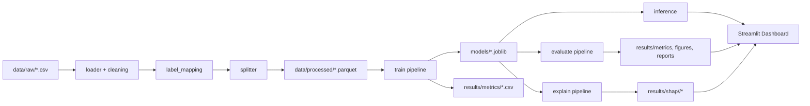

# Architecture

Big-picture view of how the project is organized and why.

## Module map

```
src/
├── config/         constants + YAML loader  ->  read by everything else
├── data/           CSV loader, schema, EDA, label_mapping, splitter
├── features/       cleaning, encoding, selection, sklearn Pipeline, validator
├── models/         BaseModel + RF / XGBoost / LightGBM / CatBoost / MLP + tuner + registry
├── evaluation/     metrics, confusion matrix, comparison report
├── explainability/ SHAP analyzer (TreeExplainer + KernelExplainer fallback)
├── inference/      batch prediction on user CSVs
├── visualization/  shared plot helpers
├── utils/          logging, deterministic seeding, joblib I/O
└── pipelines/      end-to-end stage runners called by main.py
```

## Layering rule

```
config + utils       <-  imported by everyone, import nothing project-wise
   |
data + features      <-  data layer; depends only on config + utils
   |
models               <-  depends on data, features, config, utils
   |
evaluation + xai     <-  depends on models + data
   |
inference            <-  depends on models + features (validator)
   |
pipelines            <-  composes everything; imported by main.py + dashboard
```

A lower layer must never import from a higher one. This keeps cycles
impossible by construction.

## Key architectural decisions

- **Dataset** = CICIDS2017 (8 CSVs, ~2.8M flow records, 78 features).
- **Two classification modes** — `binary` (Normal/Attack) and
  `multiclass` (10 attack families). Selected via
  `config.yaml::classification.mode`. The label mapper handles both.
- **Five models** — Random Forest, XGBoost, LightGBM, CatBoost,
  MLPClassifier. LogisticRegression kept as an optional baseline.
- **Class imbalance** — `class_weight="balanced"` for RF / LR /
  LightGBM, `auto_class_weights="Balanced"` for CatBoost, none for
  XGBoost / MLP (rely on subsampling + boosting's intrinsic robustness).
- **Stratified 60 / 20 / 20** train / val / test split. Test set is
  carved out first to keep it untouched through tuning.
- **sklearn Pipeline wraps scaler + classifier** -- leakage-proof.
- **SHAP** -- TreeExplainer (RF / XGB / LightGBM / CatBoost),
  KernelExplainer (MLP, slower, sampled).
- **Streamlit** dashboard, 6 pages.
- **Single `RANDOM_STATE=42`** constant in `src/config/constants.py`.
- **YAML config** -- no magic numbers in code.
- **stdlib `logging`** -- no `print`.

## Data flow diagram



## Storage formats

| Layer | Format | Why |
|-------|--------|-----|
| `data/raw/` | CSV | as delivered by UNB CIC |
| `data/processed/` | Parquet + joblib | train/val/test split + fitted label encoder + feature_names.json |
| `data/sample/` | CSV | synthetic CICIDS-shaped fixture used by tests + dashboard demo |
| `models/` | joblib | sklearn / xgboost / lightgbm / catboost artefacts |
| `results/metrics/` | CSV + JSON | grep-friendly + machine-readable |
| `results/figures/`, `results/shap/<model>/` | PNG | embeddable in reports + dashboard |
| `reports/` | Markdown | human-readable summaries |
