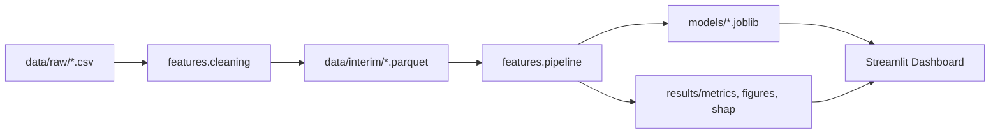

# Architecture

Big-picture view of how the project is organized and why.

## Module map

```
src/
├── config/         constants + YAML loader  →  read by everything else
├── data/           CSV loader, schema, EDA
├── features/       cleaning, encoding, selection, sklearn Pipeline
├── models/         LR / RF / MLP wrappers + GridSearch tuner
├── evaluation/     metrics, confusion matrix, comparison report
├── explainability/ SHAP analyzer (TreeExplainer on RF)
├── visualization/  shared plot helpers
├── utils/          logging, deterministic seeding, joblib I/O
└── pipelines/      end-to-end stage runners called by main.py
```

## Layering rule

```
config + utils       ←  imported by everyone, import nothing project-wise
   ↑
data + features      ←  data layer; depends only on config + utils
   ↑
models               ←  depends on data, features, config, utils
   ↑
evaluation + xai     ←  depends on models + data
   ↑
pipelines            ←  composes everything; imported by main.py + dashboard
```

A lower layer must never import from a higher one. This keeps cycles
impossible by construction.

## Key architectural decisions (ADRs)

See README and Phase 1 doc. Headline list:

- **ADR-001** Dataset = CICIDS2017 (primary), UNSW-NB15 (optional)
- **ADR-002** 4 target classes only; extensible via config
- **ADR-003** Three models: LR, RF, MLP
- **ADR-004** Class imbalance → `class_weight='balanced'` default, SMOTE optional
- **ADR-005** Stratified 80/20 holdout + Stratified 5-fold CV
- **ADR-006** sklearn Pipeline wraps scaler + classifier — leakage-proof
- **ADR-007** SHAP TreeExplainer on Random Forest only
- **ADR-008** Streamlit for the dashboard
- **ADR-009** Single `RANDOM_STATE=42` constant
- **ADR-010** `src/` package + `notebooks/` for narrative
- **ADR-011** YAML config (no magic numbers)
- **ADR-012** stdlib `logging`, no `print`

## Data flow diagram



## Storage formats

| Layer | Format | Why |
|-------|--------|-----|
| `data/raw/` | CSV | as delivered by UNB CIC |
| `data/interim/` | Parquet | 10× smaller, dtypes preserved |
| `data/processed/` | Parquet + joblib | train/test split + fitted encoder + scaler |
| `data/sample/` | Parquet | stratified 10k subset for tests + dashboard demo |
| `models/` | joblib | sklearn artifacts |
| `results/metrics/` | CSV | grep-friendly |
| `results/figures/`, `results/shap/` | PNG | embeddable in reports + dashboard |
| `reports/` | Markdown | human-readable summaries |
