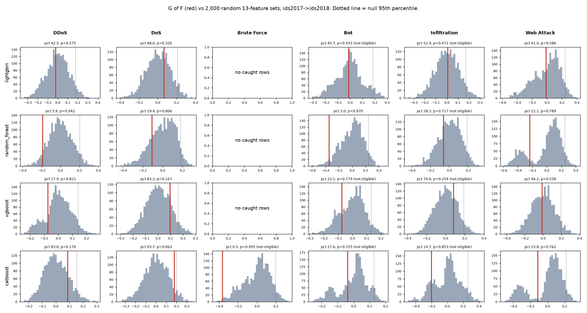
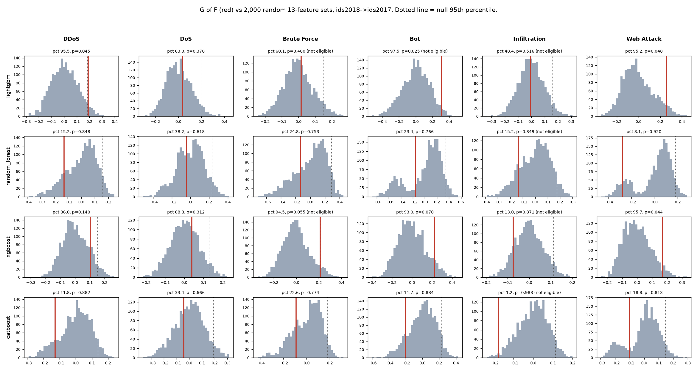

# ผล SHAP รอบ 2-3 (ข้อมูลที่อาจารย์ขอ)

วันที่ 1 ตุลาคม 2569

เอกสารนี้เอาผลรอบ 2 (LightGBM) กับรอบ 3 (RF, XGBoost, CatBoost) ที่เซฟไว้ มาจัดเป็น 4 ส่วนตามที่อาจารย์ขอ ผมไม่ได้เทรนใหม่ ใช้ค่า SHAP รายแถวที่เก็บไว้ตอนรันจริง แล้วสุ่มกลุ่ม feature 2,000 ชุดใหม่ด้วย seed เดิม ได้ค่า G และ p ตรงกับผลเดิมทุกค่า

สคริปต์: `scripts/shap_evidence_pack.py`

ไฟล์ผล: `results/crossdataset/importance_comparison/shap_evidence/`

## สรุป

ทิศ 2017 -> 2018 (ทิศที่ใช้ตัดสิน) มี 13 กรณีที่จำนวนแถวพอ ไม่ผ่านเลยสักกรณี ตัวที่ใกล้สุดคือ CatBoost DoS ได้ p = 0.064 แต่ต้องต่ำกว่า 0.017 ถึงจะผ่าน ส่วน RF ได้ G ติดลบทุก class

ทิศ 2018 -> 2017 มี 3 กรณีที่ p < 0.05 แต่ไม่ผ่าน Bonferroni และ RF กับ CatBoost ในทิศนี้ได้ G ติดลบทุก class

กลุ่ม feature สุ่ม 13 ตัวก็ได้ G กว้างพอสมควร (95th percentile อยู่ราว 0.14 ถึง 0.25) แปลว่าแถวที่ทายพลาดกับแถวที่ทายถูกต่างกันหลาย feature ไม่ได้ต่างแค่ที่กลุ่ม F

ผมจึงสรุปว่าการทายพลาดตอนข้าม dataset ไม่น่าเกิดจากกลุ่ม fingerprint กลุ่มเดียว น่าจะมาจากหลาย feature ที่ความสัมพันธ์กับ class เปลี่ยนไปเมื่อย้าย dataset ผลนี้เข้ากับคำอธิบายนี้ แต่ยังไม่ได้ทดสอบตรงๆ

## 1. รายชื่อ feature ในกลุ่ม dataset-specific (F)

F มี 13 ตัว เลือกจาก 60 feature (77 column รวม column ที่ซ้ำกันแล้วเหลือ 60) โดยใช้โมเดล adversarial คือ LightGBM ที่เทรนให้ทายว่าแถวมาจาก 2017 หรือ 2018 แล้ววัดความสำคัญของ feature 2 วิธี

- permutation importance: นับว่าผ่านถ้าค่าเฉลี่ยเป็นบวกและมากกว่า 2 เท่าของ SD ระหว่าง seed ได้ 18 ตัว
- SHAP: นับว่าผ่านถ้า share ไม่ต่ำกว่า 1/60 ทั้งค่าเฉลี่ยและใน 4 จาก 5 seed ได้ 26 ตัว

F คือ feature ที่ผ่านทั้งสองวิธี ได้ 13 ตัว ใช้ชุดนี้ตัดสินตั้งแต่รอบ 2

| feature | permutation (adversarial) | AUC ตัวเดียว | SHAP share สูงสุด |
|---|---|---|---|
| min_seg_size_forward | 0.04821 | 0.685 | 0.731 |
| RST Flag Count | 0.04133 | 0.693 | 0.698 |
| Init_Win_bytes_forward | 0.00580 | 0.716 | 0.194 |
| Destination Port | 0.00077 | 0.594 | 0.068 |
| Max Packet Length | 0.00026 | 0.805 | 0.063 |
| act_data_pkt_fwd | 0.00020 | 0.766 | 0.471 |
| Fwd IAT Min | 0.00014 | 0.706 | 0.046 |
| Init_Win_bytes_backward | 0.00010 | 0.766 | 0.300 |
| Flow IAT Min | 0.00010 | 0.694 | 0.042 |
| Bwd IAT Min | 0.00006 | 0.675 | 0.028 |
| Min Packet Length | 0.00006 | 0.605 | 0.059 |
| Bwd Packet Length Min | 0.00004 | 0.580 | 0.051 |
| Bwd Packet Length Std | 0.0000011 | 0.763 | 0.052 |

AUC ตัวเดียว คือ AUC ตอนใช้ feature นั้นตัวเดียวแยก 2017 กับ 2018 ส่วน SHAP share สูงสุด คือ share ที่สูงสุดในบรรดา class ทั้งหมด ค่า permutation ของหลายตัวเล็กมาก เพราะ feature ที่คล้ายกันแบ่งข้อมูลกันไป (เจอแล้วในรอบ 1) แต่ยังผ่านเกณฑ์ 2 SD ได้เพราะค่าแต่ละ seed ใกล้กัน

ไฟล์: `feature_group.csv` (มีครบ 60 ตัว ดูคอลัมน์ `in_F`)

## 2. ค่า SHAP ของแต่ละโมเดลและแต่ละรอบ (seed)

ทุกโมเดลตั้งค่าเหมือนกัน ใช้ split แบบ chronological และ seed 42-46

- missed คือ attack ใน test ของ dataset ปลายทางที่โมเดลทายเป็น Benign
- caught คือ attack ใน test ของ dataset ต้นทางที่โมเดลทายถูก
- ใช้ไม่เกิน 1,000 แถวต่อ class ต่อกลุ่มต่อ seed
- ดูเฉพาะ SHAP ของ output Benign ที่เป็นบวก
- s คือสัดส่วนของ SHAP บวกที่มาจาก F เฉลี่ยทุกแถว
- gap = s(missed) - s(caught) ของแต่ละ seed และ G คือค่าเฉลี่ย gap ของ 5 seed
- นับเฉพาะ class ที่มี missed อย่างน้อย 100 แถว และ caught อย่างน้อย 30 แถว ทุก seed

ถ้า F เป็นตัวที่ทำให้ทายเป็น Benign จริง gap ควรเป็นบวกทุก seed

### ทิศ 2017 -> 2018 (ใช้ตัดสิน)

| model | class | seed 42 | 43 | 44 | 45 | 46 | G | s(missed) | s(caught) |
|---|---|---|---|---|---|---|---|---|---|
| lightgbm | DDoS | -0.018 | -0.048 | -0.047 | -0.025 | +0.032 | -0.021 | 0.445 | 0.466 |
| lightgbm | DoS | +0.097 | +0.005 | +0.050 | +0.091 | +0.088 | +0.066 | 0.383 | 0.317 |
| lightgbm | Web Attack | -0.232 | +0.090 | +0.067 | +0.030 | -0.017 | -0.012 | 0.451 | 0.463 |
| random_forest | DDoS | -0.212 | -0.155 | -0.146 | -0.233 | -0.191 | -0.188 | 0.241 | 0.429 |
| random_forest | DoS | -0.127 | -0.088 | -0.142 | -0.070 | -0.106 | -0.107 | 0.184 | 0.291 |
| random_forest | Bot | -0.424 | -0.274 | -0.271 | -0.402 | -0.353 | -0.345 | 0.186 | 0.531 |
| random_forest | Web Attack | -0.254 | -0.136 | -0.280 | -0.265 | -0.243 | -0.236 | 0.302 | 0.538 |
| xgboost | DDoS | -0.066 | -0.060 | -0.067 | -0.089 | -0.086 | -0.074 | 0.508 | 0.582 |
| xgboost | DoS | +0.120 | +0.148 | +0.038 | +0.079 | +0.099 | +0.097 | 0.461 | 0.364 |
| xgboost | Web Attack | -0.082 | -0.039 | +0.038 | -0.047 | +0.071 | -0.012 | 0.495 | 0.507 |
| catboost | DDoS | +0.054 | +0.012 | +0.140 | +0.078 | +0.153 | +0.087 | 0.553 | 0.466 |
| catboost | DoS | +0.199 | +0.103 | +0.203 | +0.146 | +0.237 | +0.177 | 0.446 | 0.269 |
| catboost | Web Attack | -0.267 | -0.055 | -0.164 | -0.180 | +0.097 | -0.114 | 0.543 | 0.657 |

s(missed) และ s(caught) ในตารางเป็นค่าเฉลี่ย 5 seed

ทิศนี้ Brute Force ไม่มีแถว caught เลย เพราะพอแบ่งตามเวลา Brute Force ของ 2017 ไปอยู่ใน train เกือบหมด ส่วน Bot กับ Infiltration บางโมเดลมี missed ไม่ถึง 100 แถว จึงไม่ได้ใส่ในตาราง แต่มีค่าอยู่ในไฟล์

DoS เป็น class เดียวที่ gap เป็นบวกทุก seed ใน LightGBM, XGBoost และ CatBoost แต่ใน RF ติดลบทุก seed ส่วน DDoS กับ Web Attack แต่ละโมเดลได้เครื่องหมายไม่เหมือนกัน

### ทิศ 2018 -> 2017 (รายงานอย่างเดียว)

| model | class | seed 42 | 43 | 44 | 45 | 46 | G | s(missed) | s(caught) |
|---|---|---|---|---|---|---|---|---|---|
| lightgbm | DDoS | +0.248 | +0.138 | +0.205 | +0.225 | +0.132 | +0.190 | 0.384 | 0.194 |
| lightgbm | DoS | +0.162 | -0.033 | +0.092 | +0.077 | -0.122 | +0.035 | 0.384 | 0.349 |
| lightgbm | Web Attack | +0.210 | +0.370 | +0.262 | +0.250 | +0.200 | +0.258 | 0.507 | 0.249 |
| random_forest | DDoS | -0.118 | -0.154 | -0.121 | -0.130 | -0.111 | -0.127 | 0.399 | 0.526 |
| random_forest | DoS | -0.071 | -0.059 | -0.027 | -0.020 | -0.035 | -0.042 | 0.458 | 0.500 |
| random_forest | Brute Force | -0.169 | -0.219 | -0.074 | -0.082 | -0.129 | -0.134 | 0.122 | 0.256 |
| random_forest | Bot | +0.067 | -0.022 | -0.103 | -0.435 | -0.298 | -0.158 | 0.439 | 0.597 |
| random_forest | Web Attack | -0.384 | -0.245 | -0.244 | -0.296 | -0.225 | -0.279 | 0.256 | 0.534 |
| xgboost | DDoS | +0.158 | +0.143 | +0.024 | +0.094 | +0.095 | +0.103 | 0.327 | 0.224 |
| xgboost | DoS | +0.078 | -0.022 | -0.045 | +0.022 | +0.162 | +0.039 | 0.420 | 0.381 |
| xgboost | Bot | +0.207 | +0.109 | +0.140 | +0.353 | +0.315 | +0.225 | 0.547 | 0.322 |
| xgboost | Web Attack | +0.224 | +0.136 | +0.103 | +0.170 | +0.213 | +0.169 | 0.452 | 0.283 |
| catboost | DDoS | -0.047 | -0.078 | -0.219 | -0.118 | -0.179 | -0.128 | 0.378 | 0.507 |
| catboost | DoS | -0.043 | +0.010 | -0.060 | -0.052 | -0.072 | -0.044 | 0.300 | 0.344 |
| catboost | Brute Force | -0.183 | +0.011 | -0.077 | -0.205 | +0.004 | -0.090 | 0.215 | 0.305 |
| catboost | Bot | -0.187 | -0.312 | -0.245 | -0.216 | -0.056 | -0.203 | 0.351 | 0.554 |
| catboost | Web Attack | -0.100 | -0.154 | -0.050 | -0.104 | -0.099 | -0.101 | 0.393 | 0.495 |

ทิศนี้ LightGBM กับ XGBoost ได้ gap เป็นบวกเป็นส่วนใหญ่ แต่ RF กับ CatBoost ติดลบเกือบทุกช่อง

ไฟล์: `per_seed_stats.csv` (ทุกโมเดล ทุก class ทุก seed ทั้งสองทิศ มีจำนวนแถว missed ทั้งหมด จำนวนแถวที่ใช้คำนวณ และค่าเฉลี่ยของ SHAP บวกไป Benign ด้วย)

## 3. วิธีสร้างกลุ่ม feature สุ่ม 2,000 ชุด

สุ่มจาก 60 feature ชุดเดียวกับที่ใช้เลือก F ชุดละ 13 ตัวเท่ากับ F ในชุดเดียวกันไม่ซ้ำกัน (`rng.choice(60, size=13, replace=False)`) ใช้ `numpy.random.default_rng(2026)` สุ่มไปจนครบ 2,000 ชุด ทุกโมเดลเริ่มจาก seed เดียวกัน จึงได้ 2,000 ชุดเดียวกัน

แต่ละชุดคำนวณ G แบบเดียวกับ F ทุกขั้น คือคิดทั้ง 5 seed แล้วเฉลี่ย ได้เป็น G_null 2,000 ค่า แล้วคิด p ด้านเดียวจาก

    p = (1 + จำนวน G_null ที่ >= G) / (1 + 2000)

ตอนสุ่มไม่ได้เอา F ออก ชุดสุ่มจึงมี feature ของ F ปนอยู่ได้ เฉลี่ย 2.83 ตัวต่อชุด (0 ถึง 7 ตัว) ผมเช็กด้วยว่าแต่ละ feature ถูกสุ่มได้ใกล้เคียงกัน ควรได้ประมาณ 433 ครั้ง ได้จริง 390 ถึง 478 ครั้ง

ไฟล์: `random_sets.csv` (รายชื่อ feature ของทั้ง 2,000 ชุด และจำนวนที่ซ้ำกับ F), `random_set_feature_counts.csv` (แต่ละ feature ถูกสุ่มกี่ครั้ง)

## 4. ตำแหน่งของผลจริงเทียบกับ 2,000 กลุ่มสุ่ม

percentile คือร้อยละของกลุ่มสุ่มที่ได้ G ต่ำกว่า F ถ้า F มีผลจริง ค่านี้ควรสูงประมาณ 98 ถึง 99 ขึ้นไป (ขึ้นกับจำนวน class ที่ใช้หาร Bonferroni)

เกณฑ์ที่เขียนไว้ก่อนรัน: ผ่านถ้า G > 0 และ p < 0.05 / จำนวน class ที่นับ ถ้า p >= 0.05 ถือว่าไม่สนับสนุน

### ทิศ 2017 -> 2018 (ใช้ตัดสิน)

| model | class | G | null mean | null p95 | percentile | p | ผล |
|---|---|---|---|---|---|---|---|
| lightgbm | DDoS | -0.021 | -0.002 | 0.179 | 42.5 | 0.575 | ไม่สนับสนุน |
| lightgbm | DoS | +0.066 | +0.002 | 0.209 | 68.0 | 0.320 | ไม่สนับสนุน |
| lightgbm | Web Attack | -0.012 | -0.005 | 0.243 | 41.5 | 0.586 | ไม่สนับสนุน |
| random_forest | DDoS | -0.188 | -0.001 | 0.203 | 5.8 | 0.942 | ไม่สนับสนุน |
| random_forest | DoS | -0.107 | +0.002 | 0.183 | 19.4 | 0.806 | ไม่สนับสนุน |
| random_forest | Bot | -0.345 | -0.002 | 0.246 | 3.0 | 0.970 | ไม่สนับสนุน |
| random_forest | Web Attack | -0.236 | -0.008 | 0.249 | 21.1 | 0.789 | ไม่สนับสนุน |
| xgboost | DDoS | -0.074 | +0.001 | 0.140 | 17.9 | 0.821 | ไม่สนับสนุน |
| xgboost | DoS | +0.097 | +0.002 | 0.161 | 83.3 | 0.167 | ไม่สนับสนุน |
| xgboost | Web Attack | -0.012 | -0.003 | 0.195 | 46.2 | 0.538 | ไม่สนับสนุน |
| catboost | DDoS | +0.087 | +0.002 | 0.153 | 83.0 | 0.170 | ไม่สนับสนุน |
| catboost | DoS | +0.177 | +0.003 | 0.197 | 93.7 | 0.064 | ไม่สนับสนุน |
| catboost | Web Attack | -0.114 | -0.007 | 0.219 | 23.9 | 0.762 | ไม่สนับสนุน |

ไม่มีกรณีไหนเกิน null p95 และ RF อยู่ต่ำกว่า percentile 22 ทุก class

### ทิศ 2018 -> 2017 (รายงานอย่างเดียว)

| model | class | G | null mean | null p95 | percentile | p |
|---|---|---|---|---|---|---|
| lightgbm | DDoS | +0.190 | +0.004 | 0.184 | 95.5 | 0.045 |
| lightgbm | DoS | +0.035 | +0.005 | 0.196 | 63.0 | 0.370 |
| lightgbm | Web Attack | +0.258 | -0.003 | 0.253 | 95.2 | 0.049 |
| random_forest | DDoS | -0.127 | -0.000 | 0.158 | 15.2 | 0.848 |
| random_forest | DoS | -0.042 | -0.000 | 0.232 | 38.2 | 0.618 |
| random_forest | Brute Force | -0.134 | +0.006 | 0.287 | 24.8 | 0.753 |
| random_forest | Bot | -0.158 | +0.001 | 0.347 | 23.4 | 0.766 |
| random_forest | Web Attack | -0.279 | +0.000 | 0.180 | 8.1 | 0.919 |
| xgboost | DDoS | +0.103 | +0.002 | 0.151 | 86.0 | 0.140 |
| xgboost | DoS | +0.039 | +0.003 | 0.130 | 68.8 | 0.312 |
| xgboost | Bot | +0.225 | +0.000 | 0.249 | 93.0 | 0.070 |
| xgboost | Web Attack | +0.169 | -0.001 | 0.159 | 95.7 | 0.044 |
| catboost | DDoS | -0.128 | -0.001 | 0.137 | 11.8 | 0.882 |
| catboost | DoS | -0.044 | +0.003 | 0.191 | 33.4 | 0.666 |
| catboost | Brute Force | -0.090 | +0.005 | 0.178 | 22.6 | 0.774 |
| catboost | Bot | -0.203 | -0.001 | 0.229 | 11.7 | 0.884 |
| catboost | Web Attack | -0.101 | -0.001 | 0.145 | 18.8 | 0.813 |

มี 3 กรณีที่ p < 0.05 คือ LightGBM DDoS, LightGBM Web Attack และ XGBoost Web Attack แต่ยังสูงกว่าเกณฑ์ Bonferroni (0.05/3 = 0.017 และ 0.05/4 = 0.0125) ส่วน RF กับ CatBoost ใน class เดียวกันอยู่ต่ำกว่าค่ากลางของ null ทั้งหมด ทิศนี้ไม่ได้ใช้ตัดสินตั้งแต่แรก

### รูป

แต่ละช่องคือโมเดล 1 ตัวกับ class 1 class แท่งสีเทาคือ histogram ของ G จากกลุ่มสุ่ม 2,000 ชุด เส้นแดงคือ G ของ F เส้นประคือ 95th percentile ของกลุ่มสุ่ม หัวช่องเขียน percentile กับ p ช่องที่เขียนว่า no caught rows คือไม่มีแถว caught ให้คำนวณ

ไฟล์: `null_position.csv` (ตารางด้านบน มี SD, z และ percentile 5/25/50/75/99 เพิ่ม), `null_distribution.csv` (G_null ครบ 2,000 ค่าของทุกโมเดล ทุก class ทั้งสองทิศ)

## สรุปและข้อจำกัด

ทั้ง 4 โมเดลไม่มีหลักฐานว่า F ทำให้ attack ถูกทายเป็น Benign ตอนข้าม dataset ค่า G ของ F อยู่ในช่วงเดียวกับกลุ่มสุ่ม และแต่ละโมเดลได้เครื่องหมายไม่ตรงกัน กลุ่มสุ่มเองก็ได้ G กว้าง แสดงว่า SHAP ที่ดันไปทาง Benign ในแถวที่ทายพลาดกระจายอยู่หลาย feature

ข้อจำกัดคืองานนี้ทดสอบแค่ F กลุ่มเดียว จึงตัดคำอธิบายว่าเกิดจาก fingerprint กลุ่มเดียวออกได้ แต่ยังไม่ได้ทดสอบโดยตรงว่าความสัมพันธ์ระหว่าง feature กับ decision boundary เปลี่ยนไป และใช้แค่ tree model ไม่มี MLP กับ LR

ผลรอบ 1-3 เก็บไว้ตามที่ได้ ไม่ได้แก้ F หรือเกณฑ์

## ไฟล์ที่เกี่ยวข้อง

- เกณฑ์ที่เขียนก่อนรัน: `results/crossdataset/importance_comparison/SHAP_ROUND2_PREREGISTRATION.md`, `SHAP_ROUND3_PREREGISTRATION.md`
- ผลเดิม: `shap_round2/null_test.csv`, `shap_round3/null_test.csv`
- รายงานเต็มรอบ 1-3: `docs/experiments/crossdataset/round5_shap/report/shap_progress.md`
