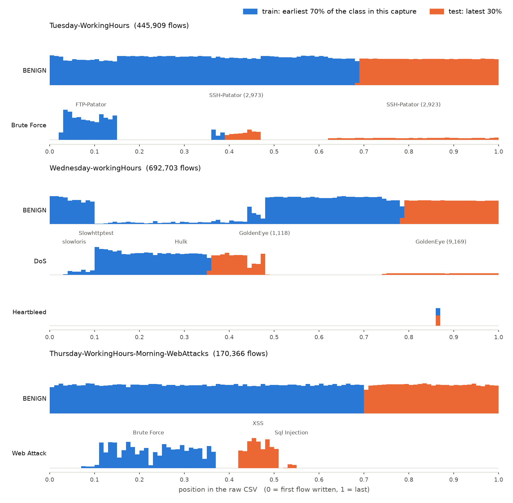
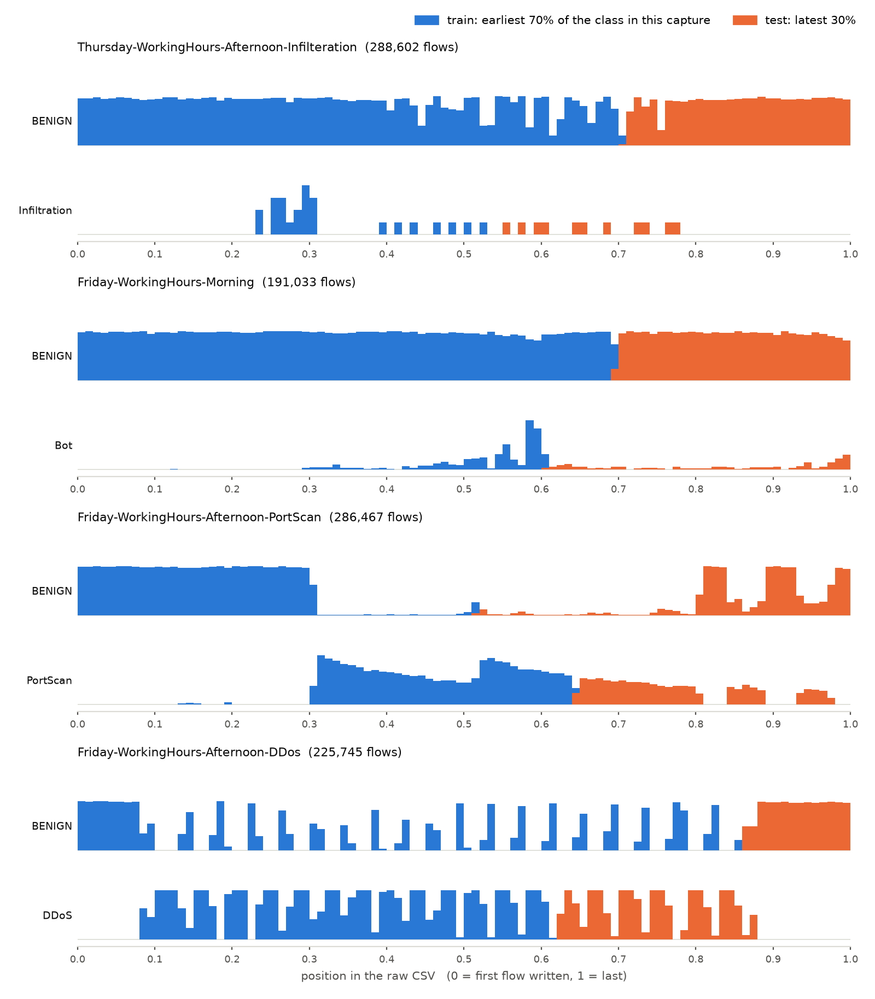

# สรุปผลตามข้อเสนอแนะ 3 ข้อ (SHAP, การแบ่งข้อมูล CICIDS2017, macro-F1 ± SD)

เอกสารรวม ณ วันที่ 3 ตุลาคม 2569 ประกอบด้วย 3 ส่วน แต่ละส่วนมีสรุปสั้นอยู่ต้นส่วน เลขหัวข้อและการอ้างถึง "หัวข้อ N" ใช้ภายในส่วนของตัวเอง

1. ส่วนที่ 1 SHAP เทียบใน dataset ปลายทางเดียวกัน
2. ส่วนที่ 2 การแบ่งข้อมูล chronological ของ CICIDS2017
3. ส่วนที่ 3 macro-F1 ค่าเฉลี่ย ± SD ควบคู่ Recovery %

ส่วนที่ 2 และ 3 ไม่ได้เทรนหรือรันการทดลองใหม่ ตัวเลขมาจากผลที่มีอยู่

---

## ส่วนที่ 1 — SHAP เทียบใน dataset ปลายทางเดียวกัน (แถวที่ทายผิดเป็น Benign กับแถวที่ทายถูก)


วันที่ 2 ตุลาคม 2569

อาจารย์ขอให้เทียบ SHAP ใน dataset ปลายทางเดียวกันและ attack class เดียวกัน ระหว่างแถวที่โมเดลทายผิดเป็น Benign กับแถวที่โมเดลทายถูก เพื่อดูว่าความต่างที่เห็นในรอบก่อนมาจากการทายผิดจริง หรือแค่เพราะข้อมูลมาจากคนละ dataset

สคริปต์: `scripts/shap_within_target.py`

กติกาเขียนไว้ก่อนรัน: `results/crossdataset/importance_comparison/SHAP_WITHIN_TARGET_PREREGISTRATION.md`

ไฟล์ผล: `results/crossdataset/importance_comparison/shap_within_target/`

### สรุป

ไม่ผ่านทุกโมเดล (LightGBM, XGBoost, CatBoost, RF) และทุกชุด feature

class ที่จำนวนแถวพอให้ตัดสินมีน้อยมาก มีแค่ DoS ทั้งสองทิศ (ทุกโมเดล) กับ Brute Force ทิศ 2018 -> 2017 (CatBoost) รวม 9 กรณี เพราะทิศ 2017 -> 2018 โมเดลแทบทาย attack ใน 2018 ไม่ถูกเลย ยกเว้น DoS

กรณี DoS ทิศ 2017 -> 2018 ตอบคำถามของอาจารย์ได้ชัดที่สุด รอบ 2-3 เคยเห็น gap เป็นบวกใน LightGBM, XGBoost และ CatBoost แต่พอเทียบกับแถวที่ทายถูกใน 2018 ด้วยกัน gap กลายเป็นติดลบทุกโมเดลและทุก seed แปลว่า gap บวกที่เคยเห็นมาจากการที่ข้อมูลมาจากคนละ dataset ไม่ได้มาจากการทายผิด

ผลนี้เข้ากับข้อสรุปเดิม คือการทายพลาดตอนข้าม dataset ไม่ได้เกิดจากกลุ่ม fingerprint F กลุ่มเดียว

### 1. วิธีทำ

ใช้โมเดล split และแถวเดียวกับรอบ 2 (LightGBM) และรอบ 3 (RF, XGBoost, CatBoost) ทุกอย่าง แบ่งแถวเป็น 3 กลุ่ม ในแต่ละ class

- missed: แถว attack ใน test ของ dataset ปลายทางที่โมเดลทายเป็น Benign (เอามาจาก cache รอบ 2-3)
- caught_tgt: แถว attack ใน test ของ dataset ปลายทางที่โมเดลทายถูก (กลุ่มใหม่ รอบนี้คำนวณเพิ่มกลุ่มเดียว)
- caught_src: แถว attack ใน test ของ dataset ต้นทางที่โมเดลทายถูก (กลุ่ม caught เดิมของรอบ 2-3)

แถวที่โมเดลทายเป็น attack class อื่นไม่ได้ใช้

ตอนคำนวณ caught_tgt ต้องเทรนโมเดลใหม่ด้วย seed เดิม สคริปต์เช็กว่าจำนวน missed ต่อ class ตรงกับ cache ทุก seed ถ้าไม่ตรงจะหยุด ผลคือตรงทุก seed และค่า G ที่คำนวณใหม่จากกลุ่ม missed กับ caught_src ตรงกับค่า G ของรอบ 2-3 ทั้ง 144 ค่า

ตั้งค่าเหมือนรอบ 2

- 60 feature, split แบบ chronological, seed 42-46
- ใช้ไม่เกิน 1,000 แถวต่อ class ต่อกลุ่มต่อ seed
- ดูเฉพาะ SHAP ของ output Benign ที่เป็นบวก
- s(กลุ่ม) คือสัดส่วนของ SHAP บวกที่มาจาก F เฉลี่ยทุกแถวในกลุ่ม
- F หลักคือชุด consensus 13 ตัว (ชุดเดียวกับเอกสารวันที่ 1 ต.ค.) และรายงานชุด SHAP 26 ตัวกับ permutation 18 ตัวด้วย

ค่าที่ใช้

- G_within = s(missed) - s(caught_tgt) เฉลี่ย 5 seed ใช้ค่านี้ตัดสิน
- G_old = s(missed) - s(caught_src) คือ G ของรอบ 2-3
- G_dataset = s(caught_tgt) - s(caught_src) ใช้อธิบายอย่างเดียว

G_old = G_within + G_dataset เสมอ เลยแยกได้ว่า gap เดิมมาจากการทายผิดเท่าไหร่ และมาจากการต่าง dataset เท่าไหร่

null คือสุ่มกลุ่ม feature ขนาดเท่ากัน 2,000 ชุด seed 2026 เหมือนรอบ 3

เกณฑ์

- นับเฉพาะกรณีที่มี missed อย่างน้อย 100 แถว และ caught_tgt อย่างน้อย 30 แถว ทุก seed
- ผ่าน: G_within > 0 และ p < 0.05 / (จำนวนกรณีที่นับได้ของโมเดลนั้น)
- ไม่ผ่าน: p >= 0.05 ถ้าอยู่ระหว่างนั้นถือว่าไม่ชัด
- ตัดสินทั้งสองทิศ เพราะทิศ 2017 -> 2018 ทิศเดียวมีกรณีที่นับได้น้อยเกินไป

### 2. ผลกรณีที่นับได้ (F consensus 13 ตัว)

| model | ทิศ | class | G_within | G_old | G_dataset | null 95% | p | ผล |
|---|---|---|---|---|---|---|---|---|
| lightgbm | 2017 -> 2018 | DoS | -0.129 | +0.066 | +0.196 | 0.146 | 0.901 | ไม่ผ่าน |
| lightgbm | 2018 -> 2017 | DoS | -0.043 | +0.035 | +0.078 | 0.167 | 0.704 | ไม่ผ่าน |
| xgboost | 2017 -> 2018 | DoS | -0.087 | +0.097 | +0.184 | 0.136 | 0.816 | ไม่ผ่าน |
| xgboost | 2018 -> 2017 | DoS | +0.024 | +0.039 | +0.015 | 0.041 | 0.160 | ไม่ผ่าน |
| catboost | 2017 -> 2018 | DoS | -0.298 | +0.177 | +0.476 | 0.120 | 1.000 | ไม่ผ่าน |
| catboost | 2018 -> 2017 | DoS | +0.070 | -0.044 | -0.114 | 0.127 | 0.185 | ไม่ผ่าน |
| catboost | 2018 -> 2017 | Brute Force | -0.328 | -0.090 | +0.238 | 0.194 | 0.983 | ไม่ผ่าน |
| rf | 2017 -> 2018 | DoS | -0.468 | -0.107 | +0.361 | 0.206 | 0.999 | ไม่ผ่าน |
| rf | 2018 -> 2017 | DoS | -0.248 | -0.042 | +0.205 | 0.172 | 0.881 | ไม่ผ่าน |

เกณฑ์ผ่านคือ p < 0.025 (โมเดลที่มี 2 กรณี) หรือ p < 0.017 (CatBoost มี 3 กรณี) ไม่มีกรณีไหนเข้าใกล้ ค่า p ต่ำสุดคือ 0.160

G_within ติดลบ 7 จาก 9 กรณี แปลว่าในแถวที่ทายถูก ส่วนแบ่ง SHAP ที่ดันไปทาง Benign มาจาก F มากกว่าในแถวที่ทายพลาดด้วยซ้ำ

**ค่า gap ของแต่ละ seed (s(missed) - s(caught_tgt))**

| model | ทิศ | class | 42 | 43 | 44 | 45 | 46 |
|---|---|---|---|---|---|---|---|
| lightgbm | 2017 -> 2018 | DoS | -0.173 | -0.128 | -0.151 | -0.085 | -0.110 |
| lightgbm | 2018 -> 2017 | DoS | +0.039 | -0.091 | -0.040 | -0.007 | -0.115 |
| xgboost | 2017 -> 2018 | DoS | -0.061 | -0.055 | -0.132 | -0.100 | -0.088 |
| xgboost | 2018 -> 2017 | DoS | +0.033 | +0.035 | +0.019 | +0.038 | -0.005 |
| catboost | 2017 -> 2018 | DoS | -0.314 | -0.236 | -0.234 | -0.367 | -0.340 |
| catboost | 2018 -> 2017 | DoS | +0.068 | +0.076 | +0.088 | +0.030 | +0.090 |
| catboost | 2018 -> 2017 | Brute Force | -0.352 | -0.127 | -0.458 | -0.372 | -0.330 |
| rf | 2017 -> 2018 | DoS | -0.483 | -0.448 | -0.520 | -0.412 | -0.475 |
| rf | 2018 -> 2017 | DoS | -0.251 | -0.217 | -0.202 | -0.292 | -0.277 |

DoS ทิศ 2017 -> 2018 ติดลบทุกโมเดลทุก seed (20 จาก 20)

CatBoost DoS ทิศ 2018 -> 2017 เป็นบวกทุก seed แต่ค่าเล็ก (+0.070) และกลุ่ม feature สุ่ม 13 ตัวก็ได้ค่าระดับนี้บ่อย (p = 0.185)

**ค่า s เฉลี่ยของแต่ละกลุ่ม**

| model | ทิศ | class | s(missed) | s(caught_tgt) | s(caught_src) |
|---|---|---|---|---|---|
| lightgbm | 2017 -> 2018 | DoS | 0.383 | 0.513 | 0.317 |
| lightgbm | 2018 -> 2017 | DoS | 0.384 | 0.427 | 0.349 |
| xgboost | 2017 -> 2018 | DoS | 0.461 | 0.548 | 0.364 |
| xgboost | 2018 -> 2017 | DoS | 0.421 | 0.396 | 0.381 |
| catboost | 2017 -> 2018 | DoS | 0.446 | 0.744 | 0.269 |
| catboost | 2018 -> 2017 | DoS | 0.300 | 0.230 | 0.344 |
| catboost | 2018 -> 2017 | Brute Force | 0.215 | 0.543 | 0.305 |
| rf | 2017 -> 2018 | DoS | 0.184 | 0.652 | 0.291 |
| rf | 2018 -> 2017 | DoS | 0.458 | 0.706 | 0.500 |

ดู DoS ทิศ 2017 -> 2018 ใน LightGBM, XGBoost, CatBoost จะเห็นว่า s(missed) สูงกว่า s(caught_src) ตรงนี้คือ gap บวกที่เห็นในรอบ 2-3 แต่ s(caught_tgt) สูงกว่า s(missed) อีก แปลว่าแถว DoS ใน 2018 มี share จาก F สูงอยู่แล้วไม่ว่าจะทายถูกหรือผิด ค่าที่สูงจึงมากับ dataset ไม่ได้มากับการทายผิด

### 3. ชุด feature อื่น

ผลไม่ผ่านเหมือนกันทั้งชุด SHAP 26 ตัวและชุด permutation 18 ตัว ไม่มีกรณีไหน p < 0.05

ชุด permutation ได้เครื่องหมายของ G_within ตรงกับชุดหลักทุกกรณี

ชุด SHAP 26 ตัวต่างออกไปบ้าง LightGBM กับ XGBoost ได้ G_within เป็นบวกใน DoS ทั้งสองทิศ (+0.013 ถึง +0.090) แต่ p อยู่ระหว่าง 0.21 ถึง 0.34 คือกลุ่มสุ่มขนาดเท่ากันก็ได้ค่าแบบนี้บ่อย CatBoost DoS ทิศ 2018 -> 2017 ได้ +0.011 (p = 0.44) ส่วนกรณีอื่นของ CatBoost กับ RF ยังติดลบ

ไฟล์: `null_test.csv` (คอลัมน์ `set`)

### 4. กรณีที่นับไม่ได้

ทิศ 2017 -> 2018 โมเดลทาย attack ใน 2018 ถูกแทบเป็นศูนย์ ยกเว้น DoS (ราว 240-280 แถวต่อ seed) จึงตอบคำถามนี้ไม่ได้สำหรับ DDoS, Brute Force, Infiltration, Web Attack และ Bot

| model | ทิศ | class | missed น้อยสุด | caught_tgt น้อยสุด | เหตุผล |
|---|---|---|---|---|---|
| ทุกโมเดล | 2017 -> 2018 | DDoS | 6,081 | 0 | ทายถูก 0 แถว |
| ทุกโมเดล | 2017 -> 2018 | Brute Force | 738 | 0 | ทายถูก 0 แถว |
| ทุกโมเดล | 2017 -> 2018 | Infiltration | 1,092-1,093 | 0 | ทายถูก 0 แถว |
| ทุกโมเดล | 2017 -> 2018 | Web Attack | 257 | 0 | ทายถูก 0 แถว |
| lightgbm, xgboost, rf | 2017 -> 2018 | Bot | 8-1,133 | 0 | ทายถูก 0 แถวอย่างน้อย 1 seed |
| catboost | 2017 -> 2018 | Bot | 9 | 499 | missed น้อยเกิน |
| ทุกโมเดล | 2018 -> 2017 | DDoS | 3,500-4,584 | 2-18 | caught_tgt น้อยเกิน |
| lightgbm, xgboost | 2018 -> 2017 | Brute Force | 18-21 | 111-2,280 | missed น้อยเกิน |
| rf | 2018 -> 2017 | Brute Force | 2,728 | 5 | caught_tgt น้อยเกิน |
| ทุกโมเดล | 2018 -> 2017 | Bot | 75-584 | 0-451 | ไม่พออย่างใดอย่างหนึ่ง |
| ทุกโมเดล | 2018 -> 2017 | Web Attack | 594-598 | 1-25 | caught_tgt น้อยเกิน |
| ทุกโมเดล | 2018 -> 2017 | Infiltration | 10 | 0 | ทั้งสองกลุ่มน้อยเกิน |

มี 2 กรณีในกลุ่มนี้ที่ p < 0.05 แต่จำนวนแถวน้อยเกินจะเชื่อได้ จึงไม่นับ

- xgboost Brute Force 2018 -> 2017: G_within = +0.126, p = 0.036 แต่ missed มีแค่ 21 แถว และ seed 46 ติดลบ (-0.209)
- catboost Bot 2017 -> 2018: G_within = +0.084, p = 0.024 แต่ missed มีแค่ 9 แถว

ไฟล์: `counts.csv` (จำนวนแถวทุกกลุ่มทุก seed)

### 5. ข้อจำกัด

- ตัดสินได้แค่ 9 กรณี และ 8 ใน 9 เป็น DoS ผลนี้จึงพูดได้แน่นอนแค่เรื่อง DoS class อื่นยังตอบไม่ได้
- caught_tgt ของทิศ 2017 -> 2018 เป็นส่วนน้อยของ DoS ใน 2018 (ราว 240-280 แถว เทียบกับ missed กว่า 1,200 แถว) อาจเป็นแถว DoS แบบพิเศษที่คล้าย 2017 มากกว่าปกติ
- ยังเป็นการดู SHAP อย่างเดียว ไม่ได้ทดลองแก้ feature แล้วดูว่าการทายเปลี่ยนไหม

### 6. สิ่งที่ได้จากรอบนี้

คำถามของอาจารย์คือ gap ในรอบก่อนมาจากการทายผิด หรือจากการที่ข้อมูลอยู่คนละ dataset

สำหรับ DoS คำตอบคือมาจากการต่าง dataset เมื่อเทียบใน dataset เดียวกัน แถวที่ทายผิดไม่ได้ใช้ F มากกว่าแถวที่ทายถูก

ข้อนี้เพิ่มน้ำหนักให้ข้อสรุปเดิม ว่าการทายพลาดตอนข้าม dataset ไม่ได้มาจากกลุ่ม fingerprint กลุ่มเดียว


---

## ส่วนที่ 2 — การแบ่งข้อมูล chronological ของ CICIDS2017 เรียงตามอะไร และสะท้อนเวลาจริงแค่ไหน


เอกสารนี้อธิบายการแบ่งข้อมูล chronological (ordered) split ของ CICIDS2017 ณ วันที่ 3 ตุลาคม 2569
ว่าเรียงตามอะไร และลำดับนั้นสะท้อนเวลาจริงได้แค่ไหน

ทุกตัวเลขอ่านมาจากไฟล์ใน `results/split_audit/cicids2017/` ซึ่งสร้างด้วย
`scripts/audit_chronological_split_2017.py` จากไฟล์ดิบใน `data/raw/` และจากผลที่มีอยู่แล้วใน
`results/crossdataset/` **ไม่ได้เทรนโมเดลหรือรันการทดลองใหม่**

### สรุปสั้น

**1. เรียงตามอะไร** ตามตำแหน่งแถวของ flow ในไฟล์ CSV ต้นฉบับแต่ละไฟล์ (`_row_index` นับจาก 0 ก่อนตัดแถวใดทิ้ง)
**ไม่ใช่เวลาที่วัดได้** เพราะไฟล์ MachineLearningCVE ที่ใช้มี 79 คอลัมน์และไม่มี Timestamp การแบ่งทำแยกในทุกกลุ่ม
(ไฟล์ที่จับข้อมูล, คลาส): แถวแรก 70% ของกลุ่มเป็น train แถวท้าย 30% เป็น test

**2. สะท้อนเวลาจริงได้แค่ไหน** ได้ในระดับ "ช่วงการโจมตี" แต่ไม่ใช่นาฬิกา และมีจุดที่ขัดกับตารางเวลา

- **ที่ยืนยันได้** ลำดับแถวตรงกับตารางเวลาที่ CIC ประกาศครบทั้ง 7 คู่ (ถ้าไฟล์ถูกสลับแบบสุ่ม โอกาสผ่านทั้ง 7 คู่โดยบังเอิญคือ 1 ใน 1,440) และเมื่อตรวจเข้มขึ้นเป็น "มีแถวใดสลับหรือไม่" ใน 14 คู่ มี 13 คู่ที่ไม่มีแถวสลับเลย แม้ช่วงโจมตีห่างกันเพียง 4 ถึง 15 นาที และ `_row_index` ตรงกับตำแหน่งแถวในไฟล์ดิบครบทั้ง 2,497,980 แถวที่ clean แล้ว
- **ที่ยืนยันไม่ได้** ไม่มีเวลาจริงให้เทียบ จึงบอกไม่ได้ว่าห่างกันกี่นาที ลำดับเป็นลำดับที่ flow จบ ไม่ใช่ตอนเริ่ม (ตามพฤติกรรมของ CICFlowMeter ซึ่งไฟล์นี้พิสูจน์เองไม่ได้) และ flow ปกติไม่มีตารางเวลาให้ตรวจเลย
- **ที่ขัดกับตารางเวลา** 1 ใน 14 คู่: ใน Wednesday แถว DoS GoldenEye 4,939 จาก 10,293 แถว (48.0%) อยู่หลังแถว Heartbleed แถวแรก ทั้งที่ตารางเวลาให้ GoldenEye (11:10 ถึง 11:23) มาก่อน Heartbleed (15:12 ถึง 15:32) ราว 4 ชั่วโมง การตรวจที่รันก่อนเทรนมองไม่เห็น เพราะตรวจเพียง 1 คู่และดูแค่ค่ามัธยฐาน

**3. ผลต่อ test set** ใน CICIDS2017 ลำดับแถวตรงกับลำดับของ sub-attack ภายในคลาส "30% ท้าย" ของคลาสจึงมักเป็น
sub-attack ตัวท้ายที่ train เห็นน้อยหรือไม่เห็นเลย: test ของ Brute Force เป็น SSH-Patator ล้วน, test ของ Web Attack
เป็น XSS และ SQL Injection ล้วน, และ DoS GoldenEye 10,282 แถว (17.7% ของ test ของ DoS) ไม่อยู่ใน train
เลย ผลคือเพดาน (ceiling) ของ 2017 แบบ chronological ในงาน cross-dataset ถูกกดโดย Brute Force ที่ได้ F1 ≈ 0 ในทุกโมเดล
ดูหัวข้อ 5

**4. ในรายงาน** ควรเรียกว่า "แบ่งตามลำดับการบันทึกในไฟล์ (capture order) ภายในแต่ละกลุ่ม (ไฟล์, คลาส)" ไม่ควรเรียกว่า
แบ่งตาม timestamp หรือ "เทรนบนอดีต ทดสอบบนอนาคต" โดยไม่มีเงื่อนไข ดูหัวข้อ 6


### 1. เรียงตามอะไร

| ข้อ | รายละเอียด |
|---|---|
| ตัวบอกลำดับ | `_row_index` คือตำแหน่งแถวข้อมูลในไฟล์ CSV นับจาก 0 (ไม่นับ header) กำหนดใน `train._clean_one_frame` ทันทีหลังอ่านไฟล์ ก่อนตัดแถวใดทิ้ง จึงเป็นตำแหน่งดิบแม้แถวรอบข้างถูกตัดไปแล้ว |
| ใช้ภายในไฟล์เท่านั้น | นับใหม่จาก 0 ในทุกไฟล์ ลำดับข้ามไฟล์ไม่ได้ใช้ การแบ่งทำภายในกลุ่ม (ไฟล์, คลาส) |
| ทำไมไม่ใช้เวลา | ไฟล์ MachineLearningCVE มี 79 คอลัมน์ ไม่มี Timestamp, Flow ID, Source/Destination IP (ตรวจ header ของไฟล์ดิบแล้ว) |
| `_row_index` ตรงแถวดิบจริงไหม | เทียบทุกแถวที่ clean แล้ว 2,497,980 แถวกับแถวดิบที่ตำแหน่งนั้นด้วย 3 คอลัมน์ (Destination Port, Flow Duration, Total Fwd Packets): ไม่ตรง 0 แถว, อยู่นอกช่วง 0, index ซ้ำ 0 (ไฟล์ดิบรวม 2,830,743 แถว) |
| การแบ่ง | เรียงแถวของกลุ่มตาม `_row_index` แล้วตัด 70/30 ไม่ใช้ตัวสุ่ม ผลซ้ำได้ทุกครั้ง และสร้างตัวเลขตรงกับ manifest (train 1,748,579, test 749,401) |

ใน protocol ของ cross-dataset ใช้ตัวบอกลำดับเดียวกันสำหรับ 2017 แต่ตัดเป็น 60/10/30 (train/calibration/test) ส่วน
2018 มี Timestamp จริงจึงใช้ Timestamp


### 2. การแบ่งใช้ลำดับนี้อย่างไร

ทำแยกในทุก (ไฟล์, คลาส) เพราะแต่ละคลาสโจมตีอยู่ในไฟล์เดียว ถ้าตัดทั้งไฟล์ด้วยเวลาเดียว บางคลาสจะไม่มีข้อมูล train
เลย (เช่น Heartbleed 11 แถวอยู่ที่ตำแหน่ง 0.862 ของ Wednesday)

ตัวอย่าง Wednesday: DoS มี 193,730 แถวหลัง clean เรียงตามตำแหน่งแล้ว 135,611 แถวแรกเป็น train
58,119 แถวท้ายเป็น test แถว test แถวแรกของ DoS อยู่ที่ตำแหน่ง 0.358 ของไฟล์ ส่วน BENIGN ของไฟล์เดียวกัน
ถูกตัดที่ตำแหน่ง 0.787 **จุดตัดของแต่ละคลาสอยู่ที่ตำแหน่งต่างกัน** ไม่ใช่เส้นเวลาเดียว





แกนนอนคือลำดับแถว ไม่ใช่เวลา ช่วงที่มี flow โจมตีหนาแน่น flow ปกติจะดูบางลง (เช่น BENIGN ของ Wednesday ช่วงตำแหน่ง
0.1 ถึง 0.45) เพราะแกนนี้นับจำนวน flow ไม่ใช่นาที

ตำแหน่งที่ test เริ่มของกลุ่มโจมตีทุกกลุ่ม:

| ไฟล์ | คลาส | แถว (หลัง clean) | train / test | test เริ่มที่ตำแหน่ง | ช่วงเวลาที่ CIC ประกาศ |
|---|---|---|---|---|---|
| Tuesday | Brute Force | 9,150 | 6,405 / 2,745 | 0.393 | FTP-Patator 09:20-10:20; SSH-Patator 14:00-15:00 |
| Wednesday | DoS | 193,730 | 135,611 / 58,119 | 0.358 | DoS slowloris 09:47-10:10; DoS Slowhttptest 10:14-10:35; DoS Hulk 10:43-11:00; DoS GoldenEye 11:10-11:23 |
| Wednesday | Heartbleed | 11 | 7 / 4 | 0.863 | Heartbleed 15:12-15:32 |
| Thursday เช้า | Web Attack | 2,143 | 1,500 / 643 | 0.426 | Web Attack Brute Force 09:20-10:00; Web Attack XSS 10:15-10:35; Web Attack Sql Injection 10:40-10:42 |
| Thursday บ่าย | Infiltration | 36 | 25 / 11 | 0.554 | Infiltration 14:19-15:45 |
| Friday เช้า | Bot | 1,948 | 1,363 / 585 | 0.603 | Bot 10:02-11:02 |
| Friday บ่าย PortScan | PortScan | 90,694 | 63,485 / 27,209 | 0.646 | PortScan 13:55-15:29 |
| Friday บ่าย DDoS | DDoS | 128,014 | 89,609 / 38,405 | 0.625 | DDoS 15:56-16:16 |

**ไม่มีเส้นเวลาเดียวที่แบ่ง train จาก test ทั้งไฟล์** สัดส่วนของแถว train ที่อยู่หลังแถว test แถวแรกของไฟล์เดียวกัน:

| ไฟล์ | แถว train | แถว train ที่อยู่หลังแถว test แถวแรกของไฟล์ | สัดส่วน |
|---|---|---|---|
| Wednesday | 410,613 | 207,225 | 50.5% |
| Tuesday | 284,526 | 120,009 | 42.2% |
| Thursday เช้า | 108,119 | 41,834 | 38.7% |
| Thursday บ่าย | 169,707 | 31,594 | 18.6% |
| Friday บ่าย PortScan | 148,577 | 26,124 | 17.6% |
| Friday เช้า | 126,058 | 16,837 | 13.4% |
| Friday บ่าย DDoS | 156,156 | 16,314 | 10.4% |
| Monday | 344,823 | 0 | 0.0% |

ใน Wednesday แถว train 50.5% อยู่หลังแถว test แถวแรกของไฟล์ (ตำแหน่ง 0.358) นั่นคือ
ข้อรับประกัน "ไม่มี test flow ใดอยู่ก่อน train flow" เป็นจริงเฉพาะ**ภายในคลาสเดียวกันของไฟล์เดียวกัน**


### 3. หลักฐานว่าลำดับแถวตามเวลา

**3.1 การตรวจที่มีอยู่กับการตรวจที่เอกสารอ้าง**

| การตรวจ | ใช้ label ไหน | จำนวนคู่ | รันเมื่อไร | ผล |
|---|---|---|---|---|
| `validate_capture_chronology` | label 9 คลาสที่ยุบ sub-type แล้ว | 1 (DoS ก่อน Heartbleed) | ก่อนเทรนทุกครั้ง และใน `--stage audit --verify-data` | ผ่าน |
| `validate_raw_label_chronology` | sub-label ดิบ (FTP-Patator, slowloris ฯลฯ) | 7 | **ไม่ถูกเรียกที่ใดในไปป์ไลน์** รันด้วยมือในครั้งนี้ | ผ่านทั้ง 7 คู่ |
| ตรวจแบบ "มีแถวใดสลับหรือไม่" (สคริปต์ audit นี้) | sub-label ดิบ | 14 (ทุกคู่ตามตารางเวลา) | รันในครั้งนี้ | 13 คู่ไม่มีแถวสลับ, 1 คู่ไม่ผ่าน |

เอกสารส่งมอบของ 2017 (`README_HANDOFF.md`, `docs/experiments/ids2017/README.md`) ระบุว่า "ตรวจก่อนเทรนทุกครั้ง" ซึ่งจริงสำหรับการตรวจแรก
(1 คู่) เท่านั้น การตรวจ 7 คู่ที่เอกสารอ้างว่า "พิสูจน์" ลำดับมีในโค้ดแต่ไม่ได้ถูกเรียกใช้ ผลที่ได้ครั้งนี้ผ่านทั้ง 7 คู่
สองการตรวจแรกเทียบ**ค่ามัธยฐานตำแหน่ง**ของแต่ละ sub-label กับลำดับที่ประกาศ ซึ่งผ่านได้แม้ sub-label นั้นมีแถวจำนวนมากอยู่ผิดที่

**3.2 คู่ที่ติดกันตามตารางเวลา**

| ไฟล์ | คู่ (ก่อน → หลัง) | ห่างกันตามตารางเวลา | แถว (ก่อน / หลัง) | คู่แถวที่ลำดับสลับ | แถวของตัวก่อนที่อยู่หลังตัวหลังเริ่ม |
|---|---|---|---|---|---|
| Thursday เช้า | Web Attack Brute Force → Web Attack XSS | 15 นาที | 1,507 / 652 | 0.0% | 0 (0.0%) |
| Thursday เช้า | Web Attack XSS → Web Attack Sql Injection | 5 นาที | 652 / 21 | 0.0% | 0 (0.0%) |
| Tuesday | FTP-Patator → SSH-Patator | 3.7 ชั่วโมง | 7,938 / 5,897 | 0.0% | 0 (0.0%) |
| Wednesday | DoS slowloris → DoS Slowhttptest | 4 นาที | 5,796 / 5,499 | 0.0% | 0 (0.0%) |
| Wednesday | DoS Slowhttptest → DoS Hulk | 8 นาที | 5,499 / 231,073 | 0.0% | 0 (0.0%) |
| Wednesday | DoS Hulk → DoS GoldenEye | 10 นาที | 231,073 / 10,293 | 0.0% | 0 (0.0%) |
| **Wednesday** | **DoS GoldenEye → Heartbleed** | **3.8 ชั่วโมง** | **10,293 / 11** | **47.8%** | **4,939 (48.0%)** |

คู่ที่ไม่ติดกันอีก 7 คู่ไม่มีแถวสลับเลยเช่นกัน ช่วงโจมตีที่ห่างกันเพียง 4 ถึง 15 นาทียังแยกกันสะอาด (ไม่มีแถวของตัวก่อนอยู่หลังแถวแรกของตัวหลัง) นั่นคือความละเอียดของลำดับแถวระดับ "ก้อนการโจมตี" ที่ตรวจได้ **ความละเอียดภายในก้อนไม่มีอะไรตรวจ**

**3.3 จุดที่ขัดกับตารางเวลา: DoS GoldenEye**

ตารางเวลา CIC: GoldenEye 11:10 ถึง 11:23, Heartbleed 15:12 ถึง 15:32 แต่ในไฟล์ดิบ GoldenEye ทั้ง 10,293 แถวแตกเป็น 3 ก้อน
(ตัดที่ช่องว่างกว้างกว่า 5% ของไฟล์):

| ก้อน | แถวในไฟล์ดิบ | ตำแหน่งในไฟล์ | พอร์ตปลายทางหลัก | TCP window เริ่มต้น (fwd / bwd) | ระยะ flow (วินาที) มัธยฐาน / p95 / สูงสุด |
|---|---|---|---|---|---|
| 1 | 1,118 | 0.478 ถึง 0.480 | 80 (100%) | 29,200 / 235 | 17.5 / 24.5 / 73.6 |
| 2 | 6 | 0.596 ถึง 0.596 | 80 (100%) | 29,200 / 235 | 11.1 / 11.3 / 11.4 |
| 3 | 9,169 | 0.744 ถึง 1.000 | 80 (100%) | 29,200 / 235 | 11.5 / 100.9 / 119.6 |

- ก้อนที่ 1 (1,118 แถว) ต่อท้าย Hulk ทันที สอดคล้องกับตารางเวลา
- **ก้อนที่ 3 (9,169 แถว, 89.1% ของ GoldenEye) กระจายสม่ำเสมอจากตำแหน่ง 0.744 จนถึงแถวสุดท้ายของไฟล์** รวมถึงช่วงหลัง Heartbleed (4,939 แถวอยู่หลังแถว Heartbleed แถวแรก และทั้ง 11 แถวของ Heartbleed อยู่ก่อนแถว GoldenEye แถวสุดท้าย)
- คำอธิบายเดิมในเอกสารส่งมอบ (GoldenEye เปิด connection ค้างไว้ record จึงตามหลังช่วงโจมตี) **อธิบายส่วนนี้ไม่ได้** flow ของ 4,939 แถวที่อยู่หลัง Heartbleed มีระยะมัธยฐาน 11.5 วินาที, p95 100.5 วินาที, สูงสุด 107.8 วินาที ขณะที่ flow ที่ยาวที่สุดในทุกไฟล์คือ 120 วินาที ถ้าลำดับแถวคือลำดับที่ flow จบ flow ที่ค้างอย่างมากสองนาทีไม่ทำให้แถวไปอยู่หลังช่วงโจมตีหลายชั่วโมง
- ลายเซ็นของก้อนที่ 3 เหมือนก้อนที่ 1: ปลายทางพอร์ต 80 ทุกแถวและ TCP window เริ่มต้นชุดเดียวกัน จึงไม่น่าเป็นแถวสุ่มที่ติด label ผิดแบบกระจาย แต่สอดคล้องกับ traffic ชนิดเดียวกัน (client และ service แบบเดียวกัน)

**สมมติฐานที่เป็นไปได้ (ข้อมูลที่มีแยกไม่ได้ว่าข้อใด):** (ก) label ผูกกับคู่ IP ไม่ใช่ช่วงเวลา แถวหลังช่วงโจมตีจึงยังได้ label เดิม (ข) การโจมตียังดำเนินต่อนอกตารางที่ประกาศ
(ค) ลำดับแถวช่วงท้ายไฟล์ไม่ใช่ลำดับเวลา ทั้งสามข้อให้ข้อมูลหน้าตาเหมือนกันในไฟล์ที่ไม่มี Timestamp

ลักษณะเดียวกันพบที่ Tuesday SSH-Patator ซึ่งเป็นการโจมตีสุดท้ายของไฟล์ ตารางเวลาจึงไม่มีคู่ให้เทียบ แต่รูปร่างเหมือนกัน
(ช่วง 14:00 ถึง 15:00 ที่ประกาศ):

| ก้อน | แถวในไฟล์ดิบ | ตำแหน่งในไฟล์ | พอร์ตปลายทางหลัก | TCP window เริ่มต้น (fwd / bwd) | ระยะ flow (วินาที) มัธยฐาน / p95 / สูงสุด |
|---|---|---|---|---|---|
| 1 | 2,973 | 0.363 ถึง 0.469 | 22 (100%) | 29,200 / 247 | 1.9 / 13.4 / 119.8 |
| 2 | 1 | 0.528 ถึง 0.528 | 22 (100%) | 259 / 247 | 0.0 / 0.0 / 0.0 |
| 3 | 2,923 | 0.622 ถึง 1.000 | 22 (100%) | 29,200 / 247 | 10.3 / 13.6 / 19.6 |

ก้อนที่ 3 ของ SSH-Patator (2,923 แถว) กระจายสม่ำเสมอตั้งแต่ตำแหน่ง 0.622 ถึงท้ายไฟล์ ใช้พอร์ต 22 และ TCP window เหมือนก้อนที่ 1
แต่ flow ยาวกว่า (มัธยฐาน 10.3 วินาที เทียบ 1.9)


### 4. ข้อจำกัด: ไม่ใช่นาฬิกา

1. **ไม่มีเวลาจริง** ลำดับบอกว่าอะไรมาก่อนอะไร ไม่บอกว่าห่างกันเท่าไร ตัวเลขเวลาเดียวที่มีคือช่วงที่ CIC ประกาศ ซึ่งเป็นช่วงโดยประมาณ
2. **ลำดับเป็นลำดับที่ flow จบ ไม่ใช่ตอนเริ่ม** ตามพฤติกรรมของ CICFlowMeter ที่เขียน record เมื่อ flow สิ้นสุด ไฟล์ชุดนี้ไม่มีคอลัมน์ที่ใช้ยืนยันข้อนี้เอง
3. **ตรวจได้เฉพาะระดับก้อนการโจมตี** ภายในก้อน และ flow ปกติ (ซึ่งไม่มีตารางเวลา) ไม่มีอะไรตรวจ
4. **แกนแถวไม่เป็นเส้นตรงกับเวลา** ช่วงที่ flow โจมตีหนาแน่นกินพื้นที่แถวมากกว่าเวลาที่ใช้ (รูปที่ 1 และ 2)
5. **แถวโจมตีส่วนหนึ่งอยู่นอกช่วงที่ประกาศ** และการตรวจที่ใช้มัธยฐานมองไม่เห็น (หัวข้อ 3.3)
6. **ลำดับของแต่ละไฟล์ใช้ได้ภายในไฟล์เท่านั้น** ข้ามไฟล์ไม่ได้ใช้
7. **ไม่ได้ตรวจกับไฟล์ที่มี Timestamp** CIC แจกไฟล์ CICIDS2017 อีกชุดที่มีคอลัมน์เวลาต่อ flow ถ้าจับคู่แถวกับชุดนั้นได้ จะตรวจลำดับระดับวินาที และดูได้ว่าแถวท้ายไฟล์ของ GoldenEye และ SSH-Patator เกิดเมื่อไร แต่ยังไม่ได้หาไฟล์ชุดนั้นหรือตรวจในรอบนี้


### 5. ผลต่อ test set: ลำดับเวลา = ลำดับของ sub-attack

**5.1 แบ่ง 70/30 ของบันเดิล `cicids2017_temporal_v1`**

| คลาส | sub-attack (ตามลำดับในไฟล์) | train | test |
|---|---|---|---|
| Brute Force | FTP-Patator | 5,931 | **0** |
| Brute Force | SSH-Patator | 474 | 2,745 |
| DoS | DoS slowloris | 5,374 | **0** |
| DoS | DoS Slowhttptest | 5,228 | **0** |
| DoS | DoS Hulk | 125,009 | 47,837 |
| DoS | DoS GoldenEye | **0** | 10,282 |
| Web Attack | Web Attack Brute Force | 1,470 | **0** |
| Web Attack | Web Attack XSS | 30 | 622 |
| Web Attack | Web Attack Sql Injection | **0** | 21 |

(ตัวเลขหนาคือ 0 แถว)

- **Brute Force:** test (2,745 แถว) เป็น SSH-Patator ทั้งหมด train มี FTP-Patator 5,931 แถว และ SSH-Patator เพียง 474 แถว ในจำนวน test 1,211 แถวมาจากก้อนที่ 1 และ 1,534 แถวมาจากก้อนที่ 3 ซึ่งอยู่หลังก้อนหลักในลำดับแถว
- **Web Attack:** test 643 แถวเป็น XSS 622 และ SQL Injection 21 ทั้งหมด train มี XSS เพียง 30 แถวและไม่มี SQL Injection เลย
- **DoS:** GoldenEye 10,282 แถว (17.7% ของ test ของ DoS) อยู่ใน test ทั้งหมดและไม่อยู่ใน train เลย ในจำนวนนี้ 9,160 แถวมาจากก้อนที่ 3 ซึ่งอยู่หลัง Heartbleed ในลำดับแถว
- **Bot:** test 585 แถว อยู่ที่ตำแหน่ง 0.603 ถึง 1.000 ซึ่งเป็นส่วนหางหลังก้อนหลักของ Bot (รูปที่ 2) recall ของ Bot ที่ติดอยู่ที่ 0.150 ถึง 0.161 ในทุกโมเดล (`docs/experiments/ids2017/README.md` สรุปว่าเพดานอยู่ที่ข้อมูล) สอดคล้องกับลักษณะนี้ แต่ยังไม่ได้ตรวจว่าเป็นสาเหตุ

**5.2 แบ่ง 60/10/30 ของ cross-dataset (ตัวอย่าง 2017 จำนวน 300,000 แถว)**

| คลาส | sub-attack | train | calibration (ไม่ได้ใช้) | test |
|---|---|---|---|---|
| Brute Force | FTP-Patator | 5,490 | 441 | **0** |
| Brute Force | SSH-Patator | **0** | 474 | 2,745 |
| Web Attack | Web Attack Brute Force | 1,286 | 184 | **0** |
| Web Attack | Web Attack XSS | **0** | 30 | 622 |
| Web Attack | Web Attack Sql Injection | **0** | **0** | 21 |
| DoS | DoS slowloris | 682 | **0** | **0** |
| DoS | DoS Slowhttptest | 597 | **0** | **0** |
| DoS | DoS Hulk | 12,643 | 2,320 | 5,735 |
| DoS | DoS GoldenEye | **0** | **0** | 1,226 |

Brute Force: train เป็น FTP-Patator ล้วน (5,490 แถว) SSH-Patator 474 แถวแรกตกอยู่ในช่อง calibration ที่ยังไม่ได้ใช้ และ test (2,745 แถว) เป็น
SSH-Patator ทั้งหมด ถ้าแบ่งแบบสุ่ม ทั้ง train และ test มีทั้งสองชนิด (test: FTP-Patator 1,766 และ SSH-Patator 979)

ผลที่ตามมาของ Brute Force ในเพดานของ 2017 (protocol_v2 เฉลี่ย 5 seeds):

| โมเดล | Brute Force F1 แบบ chronological (60/10/30) | Brute Force F1 แบบสุ่ม | Brute Force recall ในบันเดิล 70/30 (train มี SSH-Patator) |
|---|---|---|---|
| catboost | 0.0013 | 0.9994 | 0.9985 |
| lightgbm | 0.0000 | 0.9995 | 0.9960 |
| logistic_regression | 0.0043 | 0.9678 | 0.9581 |
| mlp | 0.0021 | 0.9806 | 0.9621 |
| random_forest | 0.0000 | 0.9992 | 0.9767 |
| stacking | 0.0000 | 0.9995 | 0.9971 |
| xgboost | 0.0000 | 0.9997 | 0.9989 |

โมเดลที่เทรนด้วย FTP-Patator ล้วนตรวจ SSH-Patator ไม่ได้เลย (F1 0.0000 ถึง 0.0043) ขณะที่ในบันเดิล 70/30 ซึ่ง train มี SSH-Patator 474 แถว recall
อยู่ที่ 0.9581 ถึง 0.9989 สอดคล้องกับว่าเลข F1 ≈ 0 ของ Brute Force ในเพดานแบบ chronological มาจากการที่ train ไม่มี SSH-Patator
เพราะช่อง calibration กันออกไป ไม่ใช่จากความยากของคลาส (หลักฐานทางอ้อม: บันเดิล 70/30 ต่างกันหลายอย่าง ทั้งขนาด train และตัวชี้วัด ยังไม่ได้แยกทดสอบ)

**5.3 ส่วนต่างระหว่างเพดานแบบสุ่มกับ chronological ของ 2017 มาจากคลาสใด**

รายงานรอบ 4 และ 5 อธิบายว่าการแบ่งแบบสุ่มทำให้เพดานของ 2017 เฟ้อ (0.21 ถึง 0.29 ใน protocol_v2) macro-F1 เป็นค่าเฉลี่ยของ F1 รายคลาส
ส่วนต่างจึงแยกเป็นรายคลาสได้ตรงตัว:

| โมเดล | เพดาน 2017 เฟ้อขึ้น (สุ่ม − chronological) | จาก Brute Force | จาก Bot | จากอีก 5 คลาสรวมกัน | Brute Force + Bot เป็นสัดส่วน |
|---|---|---|---|---|---|
| lightgbm | 0.2450 | 0.1428 | 0.0988 | +0.0034 | 98.6% |
| catboost | 0.2534 | 0.1426 | 0.0993 | +0.0115 | 95.5% |
| stacking | 0.2526 | 0.1428 | 0.0972 | +0.0126 | 95.0% |
| xgboost | 0.2547 | 0.1428 | 0.0989 | +0.0130 | 94.9% |
| random_forest | 0.2915 | 0.1427 | 0.0972 | +0.0516 | 82.3% |
| mlp | 0.2884 | 0.1398 | 0.0837 | +0.0649 | 77.5% |
| logistic_regression | 0.2057 | 0.1376 | 0.0052 | +0.0629 | 69.4% |

**Brute Force กับ Bot สองคลาสอธิบาย 69.4% ถึง 98.6% ของส่วนต่าง** ส่วนต่างระหว่างสองโหมดจึงส่วนใหญ่เป็นผลที่
test แบบ chronological ของสองคลาสนี้เป็น sub-attack หรือช่วงท้ายที่ train ไม่เห็น ไม่ใช่ผลที่กระจายทุกคลาส การแบ่งแบบสุ่มให้ test อยู่ในการกระจายเดียวกับ train (เพดานสูง
และอาจรวมแถวที่ใกล้ซ้ำกัน) ส่วน chronological ให้ test เป็นช่วงที่ต่างออกไป (เพดานต่ำ) ข้อมูลที่มีแยกไม่ได้ว่าส่วนต่างของสองคลาสนี้เป็นผลของการรั่ว
หรือผลของช่วงที่ต่างออกไป อย่างละเท่าไร
**เพดานแบบ chronological จึงไม่ใช่ "เพดานที่ไม่รั่ว" เพียงอย่างเดียว** แต่รวมผลของการที่ train ขาด sub-attack บางตัวด้วย

ผลต่อ Recovery ทิศ 2018 ไป 2017 ของ lightgbm (เลขคณิตเพื่อดูขนาด ไม่ใช่ผลการทดลอง): ถ้า Brute Force ได้ 0.9995 เท่าแบบสุ่ม เพดานจะเป็นราว 0.8753 แทน
0.7325 และ Recovery จะลดจาก 52.8% เป็นราว 42.7% ส่วนคะแนนข้ามชุด (0.4480 ± 0.0079) ไม่เปลี่ยน ดูรายงาน
`docs/experiments/crossdataset/round5_reliability_audit/report/macro_f1_with_recovery_20261003.md`


### 6. ควรเขียนในรายงานอย่างไร

**ใช้ได้**

> แบ่งตามลำดับการบันทึกในไฟล์ (capture order) ภายในแต่ละกลุ่ม (ไฟล์ที่จับข้อมูล, คลาส): 70% แรกของคลาสในไฟล์นั้นเป็น train
> 30% ท้ายเป็น test ตัวบอกลำดับคือตำแหน่งแถวในไฟล์ CSV ต้นฉบับ เพราะไฟล์ MachineLearningCVE ไม่มี Timestamp ลำดับนี้ตรงกับตารางเวลาที่ CIC
> ประกาศในระดับช่วงการโจมตี แต่ไม่ใช่เวลาที่วัดได้

**ไม่ควรเขียน**

| ข้อความ | ทำไม |
|---|---|
| "แบ่งตาม timestamp" | ไม่มี Timestamp ในไฟล์ที่ใช้ |
| "เทรนบนอดีต ทดสอบบนอนาคต" โดยไม่มีเงื่อนไข | ในไฟล์ที่มีการโจมตี แถว train 10.4% ถึง 50.5% อยู่หลังแถว test แถวแรกของไฟล์ (หัวข้อ 2) จริงเฉพาะภายในคลาสเดียวกัน |
| "ไม่มี test flow ใดอยู่ก่อน train flow" | จริงเฉพาะคลาสเดียวกันในไฟล์เดียวกัน |
| "ลำดับถูกพิสูจน์ว่าตรงกับเวลา" | ตรวจได้ระดับก้อนการโจมตี และมี 1 คู่ที่ขัด (หัวข้อ 3) |
| "chronological ceiling คือเพดานที่ไม่รั่ว" | รวมผลของ sub-attack ที่ train ไม่เห็นด้วย (หัวข้อ 5) |

เมื่อรายงานผลรายคลาสของ DoS, Brute Force, Web Attack ควรระบุว่า test เป็น sub-attack ที่ train เห็นน้อยหรือไม่เห็น (หัวข้อ 5.1)


### 7. ไฟล์และวิธีสร้างซ้ำ

| ไฟล์ | เนื้อหา |
|---|---|
| `results/split_audit/cicids2017/row_order_audit.json` | ผลทั้งหมด: ตำแหน่งของทุก sub-label, ก้อน, การตรวจลำดับทุกคู่, การเทียบ `_row_index`, การสร้างซ้ำ manifest |
| `results/split_audit/cicids2017/group_boundaries.csv` | ต่อ (ไฟล์, คลาส): จำนวน train/test และตำแหน่งที่ test เริ่ม |
| `results/split_audit/cicids2017/subtype_composition.csv` | ต่อ (ไฟล์, คลาส, sub-label, ก้อน): จำนวน train/test |
| `results/split_audit/cicids2017/crossdataset_partition_2017.csv` | องค์ประกอบ sub-attack ของการแบ่ง 60/10/30 และการแบ่งแบบสุ่ม |
| `results/split_audit/cicids2017/inflation_by_class.csv` | ส่วนต่างเพดานรายคลาส (v1 และ v2) |
| `docs/experiments/ids2017/data/split_audit/` | สำเนาของทั้งหมดข้างบน |
| `docs/experiments/ids2017/report/figures/` | รูปที่ 1 และ 2 |

```
python scripts/audit_chronological_split_2017.py --figure-dir docs/experiments/ids2017/report/figures
```

ใช้เวลาราว 1 นาที ต้องมี `data/raw/` และ `data/processed/cicids2017_clean.parquet`


---

## ส่วนที่ 3 — Cross-Dataset: macro-F1 (เฉลี่ย ± SD) ควบคู่ Recovery %


เอกสารนี้ทำตามที่ขอ ณ วันที่ 3 ตุลาคม 2569: นอกจาก Recovery % ให้รายงาน macro-F1 ค่าเฉลี่ย ± SD ด้วย
เพื่อให้เห็นคะแนนจริงควบคู่กัน

ตัวเลขทั้งหมดอ่านมาจาก `results.csv` ของ `protocol_v2` (รอบ 5 ตัวล่าสุด) และ `protocol_v1` (รอบ 4)
ผ่าน `scripts/analyze_crossdataset.py` ซึ่งเพิ่มตาราง `summary_macro_f1.csv` **ไม่ได้เทรนโมเดลหรือรันการทดลองใหม่** และตารางเดิมทั้งสี่ (`summary_gap`, `summary_leakage`, `summary_per_class`,
`summary_support`) ได้ค่าเท่าเดิมทุกตำแหน่ง

### สรุปสั้น

**1. Recovery % กับคะแนนจริงจัดอันดับไม่ตรงกัน** ตัวอย่างชัดที่สุดคือโหมด chronological ทิศ 2018 ไป 2017
(รอบ 5)

| โมเดล | Recovery % | อันดับตาม Recovery | macro-F1 จริง (เฉลี่ย ± SD) | อันดับตามคะแนนจริง |
|---|---|---|---|---|
| logistic_regression | 79.8% | 1 | 0.3493 ± 0.0000 | 4 |
| lightgbm | 52.8% | 2 | **0.4480 ± 0.0079** | 1 |

logistic_regression ได้ Recovery สูงสุดเพราะ Recovery คิดเทียบ ceiling ของโมเดลนั้นเอง และ ceiling ของ
logistic_regression บน 2017 ต่ำมาก (0.4050) ตัวหารจึงเล็ก ส่วน lightgbm ที่ได้คะแนนจริงสูงสุดมี
ceiling 0.7325

**2. คะแนนจริงต่ำในทั้งสองทิศ** ทิศ 2018 ไป 2017 ดีที่สุดคือ 0.4480 ± 0.0079 เทียบ ceiling 0.7325 และ
baseline 0.1294 ส่วนทิศ 2017 ไป 2018 ทุกโมเดลอยู่ที่ 0.1508 ถึง 0.2058 เทียบ
baseline 0.1337

**3. SD เล็กพอจะแยกโมเดลได้ในทิศ 2018 ไป 2017 แต่ไม่ใช่ทิศ 2017 ไป 2018** lightgbm ชนะทุก seed ในทิศแรก
(seed ที่แย่ที่สุดของ lightgbm ได้ 0.4396 ยังสูงกว่า seed ที่ดีที่สุดของทุกโมเดลอื่น ซึ่งสูงสุดคือ
stacking 0.4188) ส่วนทิศหลัง ค่าเฉลี่ย 0.2058 ± 0.0641 ของ lightgbm ถูกดึงขึ้นโดย seed 42
เพียงค่าเดียว (0.3204) อีก 4 seeds อยู่ที่ 0.1766 ถึง 0.1776

**4. SD ในโหมด chronological วัดได้เฉพาะความสุ่มของโมเดล** การแบ่งข้อมูลและการสุ่ม 300,000 แถวไม่เปลี่ยนตาม seed โมเดลที่ไม่มีส่วนสุ่ม (logistic_regression) จึงได้ SD = 0.0000 พอดี ซึ่งหมายถึง "ไม่มีอะไรเปลี่ยน"
ไม่ใช่ "เสถียรมาก" ดูหัวข้อ 1

**5. ข้อควรระวังเรื่อง ceiling ของ 2017** ceiling แบบ chronological ของ 2017 ถูกกดโดยคลาส Brute Force
ที่ได้ F1 0.0000 ถึง 0.0043 ในทุกโมเดล (แบบสุ่มได้ 0.9678 ถึง 0.9997) เพราะ train
ไม่มี SSH-Patator เลย ตัวหารของ Recovery จึงเล็กลงและ Recovery ของทิศ 2018 ไป 2017 สูงขึ้นตามไปด้วย ดูหัวข้อ 6
และรายงานการแบ่งข้อมูล `docs/experiments/ids2017/report/chronological_split_explained.md`


### 1. วิธีอ่านตาราง

| คอลัมน์ | ความหมาย |
|---|---|
| baseline | macro-F1 ของการเดาว่าทุกแถวเป็น Benign ทุกโมเดลได้ค่าเดียวกัน: 0.1337 บน test ของ 2018, 0.1294 บน test ของ 2017 |
| ceiling | macro-F1 ของโมเดลเดียวกันที่เทรนและทดสอบบน dataset ปลายทาง (เฉลี่ย ± SD) |
| macro-F1 ข้ามชุด | คะแนนจริงของโมเดลที่เทรนกับอีก dataset แล้วทดสอบกับ dataset ปลายทาง เฉลี่ย ± SD ของ 5 seeds (42 ถึง 46) |
| ต่ำสุด–สูงสุด | ค่าต่ำสุดและสูงสุดของ 5 seeds ใช้ดูว่าค่าเฉลี่ยมาจากหลาย seed หรือเพียงค่าเดียว |
| Recovery % | (ข้ามชุด − baseline) / (ceiling − baseline) × 100 คิดจากค่าเฉลี่ย ตรงกับตัวเลขในรายงานรอบ 4 และ 5 ทุกตัว |
| อันดับ F1 / Recovery | อันดับของโมเดลในตารางนั้นตามคะแนนจริง และตาม Recovery |

macro-F1 ในตารางหลักคือ `f1_macro_all` เฉลี่ยทุกคลาสที่ปรากฏใน test ซึ่งเป็นตัวเดียวกับที่ Recovery ใช้
ค่าที่นับเฉพาะคลาสที่มี test อย่างน้อย 30 แถวอยู่ในหัวข้อ 5

**SD อ่านอย่างไร**

- **ค่า SD คือ sample SD ของ 5 seeds (หารด้วย n − 1)** ช่วงเชื่อมั่น 95% ของค่าเฉลี่ยประมาณ ± 1.24 × SD (t ที่ 4 องศาอิสระ)
- **โหมด chronological** ตัวอย่าง 300,000 แถวถูกสุ่มครั้งเดียว (seed 42) และการแบ่ง train/test ไม่ใช้ seed seed ทั้งห้าจึงต่างกันที่ค่าเริ่มต้นของโมเดลอย่างเดียว SD ที่ได้คือความผันผวนจากโมเดล **ไม่ใช่** ความผันผวนจากข้อมูลหรือจากการเลือกช่วงเวลา โมเดลที่ไม่มีส่วนสุ่มได้ SD = 0.0000 พอดี
- **โหมด random** seed เปลี่ยนการแบ่งด้วย SD จึงรวมความผันผวนจากการแบ่งข้อมูลเข้าไปด้วย
- **ทั้งสองโหมดไม่รวมความผันผวนจากการสุ่ม 300,000 แถว** ออกจาก corpus เต็ม เพราะสุ่มครั้งเดียว SD ที่เห็น จึงน่าจะต่ำกว่าความไม่แน่นอนจริง


### 2. ผลหลัก: protocol_v2, โหมด chronological

โหมดที่ข้อสรุปของรอบ 4 และ 5 ยืนอยู่ เรียงตามคะแนนจริงจากมากไปน้อย

**2.1 เทรนด้วย 2018 ทดสอบกับ 2017 (baseline 0.1294)**

| โมเดล | ceiling (เทรนและทดสอบบน 2017) | **macro-F1 ข้ามชุด** (เฉลี่ย ± SD) | ต่ำสุด–สูงสุดของ 5 seeds | Recovery % | อันดับ F1 / Recovery |
|---|---|---|---|---|---|
| lightgbm | 0.7325 ± 0.0008 | **0.4480 ± 0.0079** | 0.4396–0.4575 | 52.8% | 1 / 2 |
| stacking | 0.7219 ± 0.0036 | **0.3674 ± 0.0386** | 0.3312–0.4188 | 40.2% | 2 / 3 |
| xgboost | 0.7172 ± 0.0050 | **0.3615 ± 0.0182** | 0.3427–0.3831 | 39.5% | 3 / 5 |
| logistic_regression | 0.4050 ± 0.0000 | **0.3493 ± 0.0000** | 0.3493–0.3493 | 79.8% | 4 / 1 |
| mlp | 0.5860 ± 0.0321 | **0.3107 ± 0.0248** | 0.2936–0.3535 | 39.7% | 5 / 4 |
| catboost | 0.7161 ± 0.0050 | **0.2226 ± 0.0041** | 0.2181–0.2290 | 15.9% | 6 / 6 |
| random_forest | 0.6652 ± 0.0109 | **0.1680 ± 0.0007** | 0.1672–0.1689 | 7.2% | 7 / 7 |

- **อันดับต่างกันใน 5 จาก 7 โมเดล** ต่างมากที่สุดคือ logistic_regression: อันดับ 1 โดย Recovery แต่อันดับ 4 โดยคะแนนจริง (0.3493 ± 0.0000) ต่ำกว่า lightgbm (0.4480 ± 0.0079) อยู่ 0.0987
- **lightgbm ชนะทุก seed** ค่าต่ำสุดของ lightgbm (0.4396) สูงกว่าค่าสูงสุดของโมเดลอื่นทุกตัว
- **stacking ผันผวนที่สุด** SD 0.0386 (0.3312 ถึง 0.4188) ในรอบ 4 stacking เคยเป็นผลดีที่สุดของงาน ดูหัวข้อ 4

**2.2 เทรนด้วย 2017 ทดสอบกับ 2018 (baseline 0.1337)**

| โมเดล | ceiling (เทรนและทดสอบบน 2018) | **macro-F1 ข้ามชุด** (เฉลี่ย ± SD) | ต่ำสุด–สูงสุดของ 5 seeds | Recovery % | อันดับ F1 / Recovery |
|---|---|---|---|---|---|
| lightgbm | 0.8596 ± 0.0006 | **0.2058 ± 0.0641** | 0.1766–0.3204 | 9.9% | 1 / 1 |
| mlp | 0.8228 ± 0.0115 | **0.1755 ± 0.0014** | 0.1735–0.1773 | 6.1% | 2 / 2 |
| catboost | 0.8480 ± 0.0036 | **0.1726 ± 0.0009** | 0.1711–0.1734 | 5.4% | 3 / 3 |
| random_forest | 0.8412 ± 0.0018 | **0.1717 ± 0.0001** | 0.1716–0.1719 | 5.4% | 4 / 3 |
| stacking | 0.8283 ± 0.0021 | **0.1715 ± 0.0007** | 0.1706–0.1725 | 5.4% | 5 / 3 |
| xgboost | 0.8539 ± 0.0026 | **0.1712 ± 0.0001** | 0.1711–0.1713 | 5.2% | 6 / 6 |
| logistic_regression | 0.7511 ± 0.0000 | **0.1508 ± 0.0000** | 0.1508–0.1508 | 2.8% | 7 / 7 |

- **ทุกโมเดลอยู่ใกล้ baseline** คะแนนจริง 0.1508 ถึง 0.2058 ส่วนที่เพิ่มจาก baseline ไม่เกิน 0.0721 ขณะที่ ceiling อยู่ที่ 0.7511 ถึง 0.8596
- **lightgbm ถูกดึงขึ้นโดย seed เดียว** ค่าเฉลี่ย 0.2058 ± 0.0641 (Recovery 9.9%) ประกอบด้วย seed 42 = 0.3204 (Recovery 25.7%) และอีก 4 seeds = 0.1766 ถึง 0.1776 (Recovery 5.9% ถึง 6.0%) ถ้าไม่นับ seed 42 lightgbm ใกล้เคียงโมเดลอื่น (มัธยฐาน 0.1775 เทียบ 0.1508 ถึง 0.1755 ของห้าโมเดลที่ไม่ใช่ logistic_regression) ตัวเลข "lightgbm ดีที่สุดของทิศนี้" ในรายงานรอบ 4 และ 5 จึงควรอ่านพร้อมข้อนี้


### 3. protocol_v2, โหมด random

โหมดที่ protocol ของอาจารย์กำหนด เรียงตามคะแนนจริง

**3.1 เทรนด้วย 2018 ทดสอบกับ 2017 (baseline 0.1294)**

| โมเดล | ceiling (เทรนและทดสอบบน 2017) | **macro-F1 ข้ามชุด** (เฉลี่ย ± SD) | ต่ำสุด–สูงสุดของ 5 seeds | Recovery % | อันดับ F1 / Recovery |
|---|---|---|---|---|---|
| stacking | 0.9745 ± 0.0096 | **0.3071 ± 0.0360** | 0.2738–0.3673 | 21.0% | 1 / 2 |
| lightgbm | 0.9775 ± 0.0117 | **0.2924 ± 0.0594** | 0.2305–0.3744 | 19.2% | 2 / 3 |
| xgboost | 0.9716 ± 0.0171 | **0.2661 ± 0.0241** | 0.2283–0.2914 | 16.2% | 3 / 4 |
| logistic_regression | 0.6107 ± 0.0158 | **0.2544 ± 0.0265** | 0.2073–0.2702 | 26.0% | 4 / 1 |
| catboost | 0.9694 ± 0.0108 | **0.2327 ± 0.0204** | 0.2054–0.2524 | 12.3% | 5 / 6 |
| mlp | 0.8744 ± 0.0127 | **0.2280 ± 0.0168** | 0.2121–0.2471 | 13.2% | 6 / 5 |
| random_forest | 0.9566 ± 0.0209 | **0.1508 ± 0.0013** | 0.1490–0.1525 | 2.6% | 7 / 7 |

**3.2 เทรนด้วย 2017 ทดสอบกับ 2018 (baseline 0.1337)**

| โมเดล | ceiling (เทรนและทดสอบบน 2018) | **macro-F1 ข้ามชุด** (เฉลี่ย ± SD) | ต่ำสุด–สูงสุดของ 5 seeds | Recovery % | อันดับ F1 / Recovery |
|---|---|---|---|---|---|
| lightgbm | 0.8696 ± 0.0050 | **0.3018 ± 0.0312** | 0.2690–0.3531 | 22.8% | 1 / 1 |
| stacking | 0.8388 ± 0.0030 | **0.2841 ± 0.0106** | 0.2660–0.2929 | 21.3% | 2 / 2 |
| xgboost | 0.8674 ± 0.0022 | **0.2731 ± 0.0649** | 0.1649–0.3354 | 19.0% | 3 / 3 |
| mlp | 0.8206 ± 0.0127 | **0.1748 ± 0.0354** | 0.1476–0.2351 | 6.0% | 4 / 4 |
| catboost | 0.8590 ± 0.0016 | **0.1728 ± 0.0050** | 0.1663–0.1775 | 5.4% | 5 / 5 |
| random_forest | 0.8624 ± 0.0046 | **0.1718 ± 0.0095** | 0.1588–0.1835 | 5.2% | 6 / 6 |
| logistic_regression | 0.7775 ± 0.0088 | **0.1380 ± 0.0007** | 0.1371–0.1389 | 0.7% | 7 / 7 |

- **ceiling ของ 2017 สูงมาก** (0.9566 ถึง 0.9775 ในโมเดลที่ไม่ใช่ logistic_regression/mlp) Recovery ของทิศ 2018 ไป 2017 จึงเล็ก (2.6% ถึง 26.0%) เทียบกับ 7.2% ถึง 79.8% ในโหมด chronological
- **คะแนนข้ามชุดเองก็เปลี่ยนตามโหมด ไม่ใช่เฉพาะ ceiling** ทิศ 2018 ไป 2017: lightgbm 0.4480 (chronological) เป็น 0.2924 (random), stacking 0.3674 เป็น 0.3071, xgboost 0.3615 เป็น 0.2661 ส่วนต่างส่วนใหญ่อยู่ที่ Brute Force ในทั้งสามโมเดล (lightgbm 0.965 เป็น 0.586) และที่ Bot ใน lightgbm (0.883 เป็น 0.273) ซึ่งสอดคล้องกับองค์ประกอบของ test: ของ 2017 แบบ chronological Brute Force เป็น SSH-Patator ล้วน ส่วนแบบสุ่มมีทั้ง FTP-Patator (1,766 แถว) และ SSH-Patator (979 แถว) ยังไม่ได้ทดสอบรายsub-attack ว่าเป็นสาเหตุโดยตรง ข้อความในรายงานรอบ 5 หัวข้อ 4.3 ที่ว่า "แม้ transfer จริงจะไม่ได้เปลี่ยน" จึงไม่ตรงกับตัวเลขเหล่านี้ (ทั้ง ceiling และคะแนนข้ามชุดเปลี่ยน)
- **SD ใหญ่กว่าโหมด chronological** เพราะรวมความผันผวนจากการแบ่ง เช่น xgboost ทิศ 2017 ไป 2018 ได้ 0.2731 ± 0.0649 (0.1649 ถึง 0.3354) และ lightgbm ทิศ 2018 ไป 2017 ได้ 0.2924 ± 0.0594
- logistic_regression ทิศ 2018 ไป 2017 อันดับ 1 โดย Recovery (26.0%) แต่อันดับ 4 โดยคะแนนจริง (0.2544 ± 0.0265) เหมือนกับโหมด chronological


### 4. เทียบ protocol_v1 กับ protocol_v2 (ทิศ 2018 ไป 2017, chronological)

สิ่งเดียวที่เปลี่ยนคือลำดับการเตรียมข้อมูลของคลัง 2018 (clean ก่อน sample) ดูรายงานรอบ 5 หัวข้อ 4

| โมเดล | v1 (รอบ 4) macro-F1 ± SD | v1 Recovery | v2 (รอบ 5) macro-F1 ± SD | v2 Recovery | v2 − v1 (macro-F1) |
|---|---|---|---|---|---|
| lightgbm | 0.5006 ± 0.0204 | 61.5% | 0.4480 ± 0.0079 | 52.8% | -0.0526 |
| stacking | 0.5756 ± 0.0352 | 73.9% | 0.3674 ± 0.0386 | 40.2% | -0.2082 |
| xgboost | 0.4376 ± 0.0255 | 51.2% | 0.3615 ± 0.0182 | 39.5% | -0.0761 |
| logistic_regression | 0.2762 ± 0.0000 | 53.3% | 0.3493 ± 0.0000 | 79.8% | +0.0731 |
| mlp | 0.3049 ± 0.0349 | 40.3% | 0.3107 ± 0.0248 | 39.7% | +0.0058 |
| catboost | 0.2830 ± 0.0075 | 26.3% | 0.2226 ± 0.0041 | 15.9% | -0.0604 |
| random_forest | 0.1615 ± 0.0046 | 6.0% | 0.1680 ± 0.0007 | 7.2% | +0.0065 |

stacking ที่เคยเป็นผลดีที่สุดของงาน (0.5756 ± 0.0352, Recovery 73.9%) เหลือ 0.3674 ± 0.0386
(Recovery 40.2%) และ lightgbm กลายเป็นอันดับ 1 ตรงกับที่รายงานรอบ 5 สรุปว่าตัวเลข
73.9% เป็นผลของคลัง 2018 เวอร์ชันเดิม ตาราง v1 และ v2 ครบทั้งสองทิศและสองโหมดอยู่ในภาคผนวก


### 5. macro-F1 เฉพาะคลาสที่วัดได้ (protocol_v2, chronological, ทิศ 2018 ไป 2017)

คลาสที่มี test น้อยกว่า 30 แถวมีน้ำหนักเท่าคลาสที่มีหมื่นแถวในค่าเฉลี่ย ในการทดสอบกับ 2017 คลาส
Infiltration มี test เพียง 10 แถว จึงถูกตัดออกจากค่านี้ (เหลือ 6 คลาส) ส่วนการทดสอบกับ 2018 ครบ 7 คลาส
ค่าทั้งสองแบบจึงเท่ากัน

| โมเดล | macro-F1 ทุกคลาส (7) | macro-F1 เฉพาะคลาสที่วัดได้ (6) |
|---|---|---|
| lightgbm | 0.4480 ± 0.0079 | 0.5226 ± 0.0093 |
| stacking | 0.3674 ± 0.0386 | 0.4286 ± 0.0451 |
| xgboost | 0.3615 ± 0.0182 | 0.4217 ± 0.0212 |
| logistic_regression | 0.3493 ± 0.0000 | 0.4075 ± 0.0000 |
| mlp | 0.3107 ± 0.0248 | 0.3624 ± 0.0289 |
| catboost | 0.2226 ± 0.0041 | 0.2597 ± 0.0048 |
| random_forest | 0.1680 ± 0.0007 | 0.1960 ± 0.0008 |

อันดับของโมเดลไม่เปลี่ยน คะแนนสูงขึ้น 0.028 ถึง 0.075 เพราะ Infiltration ได้ F1 เป็นศูนย์ในทุกโมเดล


### 6. ข้อควรระวัง: ceiling ของ 2017 แบบ chronological

Recovery หารด้วย (ceiling − baseline) ถ้า ceiling ต่ำผิดปกติ Recovery จะสูงขึ้นโดยที่คะแนนข้ามชุดไม่เปลี่ยน

ceiling ของ 2017 แบบ chronological ต่ำเพราะคลาส Brute Force ได้ F1 0.0000 ถึง 0.0043 ในทุกโมเดล
(แบบสุ่มได้ 0.9678 ถึง 0.9997) สาเหตุอยู่ที่ลำดับแถว: Brute Force ของ 2017 ประกอบด้วย
FTP-Patator ตามด้วย SSH-Patator ตามลำดับในไฟล์ การแบ่ง 60/10/30 จึงได้ train เป็น FTP-Patator ล้วน
(5,490 แถว) ส่วน SSH-Patator 474 แถวแรกตกอยู่ในช่อง calibration ที่ไม่ได้ใช้ และ test
(2,745 แถว) เป็น SSH-Patator ทั้งหมด โมเดลจึงไม่เคยเห็น SSH-Patator ตอนเทรน รายละเอียดและตัวเลขอยู่ใน
`docs/experiments/ids2017/report/chronological_split_explained.md` หัวข้อ 5

ผลต่อ Recovery ของ lightgbm ทิศ 2018 ไป 2017 (เลขคณิตเพื่อดูขนาด ไม่ใช่ผลการทดลอง): ถ้า Brute Force ได้
0.9995 เท่ากับโหมดสุ่ม ceiling จะเป็นราว 0.8753 แทน 0.7325 และ Recovery จะลดจาก 52.8% เป็นราว 42.7% ส่วนคะแนนข้ามชุด 0.4480 ± 0.0079 ไม่เปลี่ยน นี่คือเหตุผลที่ควรอ่านคะแนนจริงควบคู่กับ Recovery


### 7. ข้อจำกัด

1. **SD วัดความสุ่มของโมเดลเป็นหลัก** ไม่รวมการสุ่ม 300,000 แถวและไม่รวมการเลือกช่วงเวลา ดูหัวข้อ 1
2. **n = 5 seeds** SD จาก 5 ค่าเองก็ไม่แน่นอนมาก และค่าเฉลี่ยของบางเซลล์มาจาก seed เดียว (หัวข้อ 2.2) คอลัมน์ต่ำสุด–สูงสุดมีไว้ให้เห็นกรณีนี้
3. **Recovery คิดจากค่าเฉลี่ย** ไม่ใช่ค่าเฉลี่ยของ Recovery ราย seed ซึ่งต่างกันได้เมื่อ seed กระจาย (lightgbm 2017 ไป 2018: 9.9% จากค่าเฉลี่ย เทียบ 5.9% ถึง 25.7% ราย seed)
4. **ไม่ได้ทูน hyperparameter และไม่ได้ใช้ช่อง calibration** ตามรอบ 4


### 8. ไฟล์และวิธีสร้างซ้ำ

| ไฟล์ | เนื้อหา |
|---|---|
| `results/crossdataset/protocol_v2/summary_macro_f1.csv` | ตารางต้นทางของเอกสารนี้ (รอบ 5) ทั้ง 56 เซลล์: ceiling และข้ามชุด, เฉลี่ย, SD, ต่ำสุด, สูงสุด, ทั้งสองนิยาม macro-F1, baseline, Recovery % |
| `results/crossdataset/protocol_v1/summary_macro_f1.csv` | ตารางเดียวกันของรอบ 4 |
| `docs/experiments/crossdataset/round5_reliability_audit/data/summary_macro_f1_v2.csv` | สำเนาของตาราง v2 |
| `docs/experiments/crossdataset/round4_protocol_full/data/summary_macro_f1.csv` | สำเนาของตาราง v1 |

```
python scripts/analyze_crossdataset.py --run-name protocol_v2
python scripts/analyze_crossdataset.py --run-name protocol_v1
```

สคริปต์เขียน `summary_macro_f1.csv` เพิ่มจากตารางเดิมสี่ไฟล์ ซึ่งยังเหมือนเดิมทุกตำแหน่ง


### ภาคผนวก ก. protocol_v1 (รอบ 4)

**chronological, 2018 ไป 2017 (baseline 0.1294)**

| โมเดล | ceiling (เทรนและทดสอบบน 2017) | **macro-F1 ข้ามชุด** (เฉลี่ย ± SD) | ต่ำสุด–สูงสุดของ 5 seeds | Recovery % | อันดับ F1 / Recovery |
|---|---|---|---|---|---|
| stacking | 0.7329 ± 0.0042 | **0.5756 ± 0.0352** | 0.5169–0.6112 | 73.9% | 1 / 1 |
| lightgbm | 0.7325 ± 0.0008 | **0.5006 ± 0.0204** | 0.4717–0.5277 | 61.5% | 2 / 2 |
| xgboost | 0.7314 ± 0.0009 | **0.4376 ± 0.0255** | 0.4021–0.4717 | 51.2% | 3 / 4 |
| mlp | 0.5652 ± 0.0507 | **0.3049 ± 0.0349** | 0.2598–0.3577 | 40.3% | 4 / 5 |
| catboost | 0.7143 ± 0.0038 | **0.2830 ± 0.0075** | 0.2765–0.2943 | 26.3% | 5 / 6 |
| logistic_regression | 0.4050 ± 0.0000 | **0.2762 ± 0.0000** | 0.2762–0.2762 | 53.3% | 6 / 3 |
| random_forest | 0.6652 ± 0.0109 | **0.1615 ± 0.0046** | 0.1553–0.1650 | 6.0% | 7 / 7 |

**chronological, 2017 ไป 2018 (baseline 0.1320)**

| โมเดล | ceiling (เทรนและทดสอบบน 2018) | **macro-F1 ข้ามชุด** (เฉลี่ย ± SD) | ต่ำสุด–สูงสุดของ 5 seeds | Recovery % | อันดับ F1 / Recovery |
|---|---|---|---|---|---|
| lightgbm | 0.7739 ± 0.0016 | **0.1799 ± 0.0581** | 0.1539–0.2838 | 7.5% | 1 / 1 |
| logistic_regression | 0.6810 ± 0.0000 | **0.1562 ± 0.0000** | 0.1562–0.1562 | 4.4% | 2 / 2 |
| mlp | 0.7047 ± 0.0062 | **0.1532 ± 0.0005** | 0.1524–0.1538 | 3.7% | 3 / 3 |
| stacking | 0.7039 ± 0.0014 | **0.1529 ± 0.0008** | 0.1522–0.1540 | 3.6% | 4 / 4 |
| random_forest | 0.7146 ± 0.0010 | **0.1528 ± 0.0003** | 0.1522–0.1530 | 3.6% | 5 / 4 |
| xgboost | 0.7719 ± 0.0005 | **0.1523 ± 0.0009** | 0.1514–0.1536 | 3.2% | 6 / 7 |
| catboost | 0.7150 ± 0.0007 | **0.1518 ± 0.0003** | 0.1515–0.1523 | 3.4% | 7 / 6 |

**random, 2018 ไป 2017**

| โมเดล | ceiling (เทรนและทดสอบบน 2017) | **macro-F1 ข้ามชุด** (เฉลี่ย ± SD) | ต่ำสุด–สูงสุดของ 5 seeds | Recovery % | อันดับ F1 / Recovery |
|---|---|---|---|---|---|
| lightgbm | 0.9775 ± 0.0117 | **0.3480 ± 0.0115** | 0.3293–0.3597 | 25.8% | 1 / 1 |
| xgboost | 0.9725 ± 0.0169 | **0.3197 ± 0.0169** | 0.3013–0.3374 | 22.6% | 2 / 2 |
| stacking | 0.9730 ± 0.0126 | **0.3101 ± 0.0266** | 0.2706–0.3356 | 21.4% | 3 / 3 |
| catboost | 0.9695 ± 0.0108 | **0.2175 ± 0.0049** | 0.2131–0.2259 | 10.5% | 4 / 6 |
| mlp | 0.8815 ± 0.0181 | **0.2109 ± 0.0108** | 0.2015–0.2283 | 10.8% | 5 / 5 |
| logistic_regression | 0.6127 ± 0.0169 | **0.2018 ± 0.0020** | 0.1999–0.2042 | 15.0% | 6 / 4 |
| random_forest | 0.9566 ± 0.0209 | **0.1602 ± 0.0183** | 0.1470–0.1922 | 3.7% | 7 / 7 |

**random, 2017 ไป 2018**

| โมเดล | ceiling (เทรนและทดสอบบน 2018) | **macro-F1 ข้ามชุด** (เฉลี่ย ± SD) | ต่ำสุด–สูงสุดของ 5 seeds | Recovery % | อันดับ F1 / Recovery |
|---|---|---|---|---|---|
| lightgbm | 0.8019 ± 0.0251 | **0.3278 ± 0.0357** | 0.2957–0.3889 | 29.2% | 1 / 2 |
| stacking | 0.7103 ± 0.0004 | **0.3121 ± 0.0075** | 0.3041–0.3232 | 31.1% | 2 / 1 |
| xgboost | 0.7918 ± 0.0424 | **0.3105 ± 0.0159** | 0.2828–0.3223 | 27.1% | 3 / 3 |
| catboost | 0.7423 ± 0.0270 | **0.1927 ± 0.0139** | 0.1757–0.2097 | 9.9% | 4 / 4 |
| random_forest | 0.7420 ± 0.0276 | **0.1554 ± 0.0217** | 0.1429–0.1940 | 3.8% | 5 / 5 |
| mlp | 0.7344 ± 0.0236 | **0.1517 ± 0.0081** | 0.1403–0.1620 | 3.3% | 6 / 6 |
| logistic_regression | 0.7143 ± 0.0221 | **0.1340 ± 0.0007** | 0.1333–0.1347 | 0.3% | 7 / 7 |

