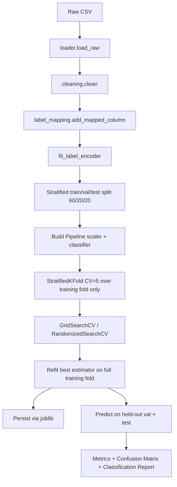

# ML Pipeline

End-to-end flow from raw CICIDS CSV to saved model artefact and metrics.

## Sequence



## Three-way split (preventing leakage)

We split *twice*:

1. From `(X, y)` carve out **test** (20%) -- never touched until the
   evaluate stage.
2. From the remaining 80% carve out **val** (20% of the remaining =
   16% of the original).

So the final split is roughly **64% train / 16% val / 20% test**, all
stratified on the encoded label. Stratification is dropped automatically
for any class that has fewer than two members in the pool being split
(sklearn would otherwise raise) -- this matters because Heartbleed has
only 11 rows in the full corpus.

## Why the scaler is inside the Pipeline

If you do this:

```python
X_train_scaled = scaler.fit_transform(X_train)
X_test_scaled  = scaler.transform(X_test)
cross_val_score(clf, X_train_scaled, y_train, cv=5)
```

then inside each CV fold the scaler was already fit on the *full*
training set, including the rows used as the validation fold. That's
leakage.

The leak-proof shape is:

```python
pipe = Pipeline([
    ("scaler", StandardScaler()),
    ("clf",    RandomForestClassifier(...)),
])
cross_val_score(pipe, X_train, y_train, cv=5)
```

Now `fit_transform` is called per fold, and scaler statistics never see
the held-out fold. Same logic protects `GridSearchCV` /
`RandomizedSearchCV`.

## Class imbalance

Per-model strategy (config-controlled):

| Model | Default | Reason |
|-------|---------|--------|
| Random Forest | `class_weight="balanced"` | supported natively |
| LightGBM | `class_weight="balanced"` | supported natively |
| CatBoost | `auto_class_weights="Balanced"` | supported natively |
| XGBoost | none | scale_pos_weight only applies to binary; for multi-class we rely on subsampling |
| MLP | none in-pipeline | MLP has no `class_weight`; toggle `imbalance_strategy: smote` in config to insert SMOTE upstream |

## Hyperparameter tuning

Two strategies, both controlled by `config.yaml::tuning`:

- `strategy: grid` -- exhaustive `GridSearchCV` over the per-model grid.
  Use when the grid is small.
- `strategy: random` (default) -- `RandomizedSearchCV` with
  `random_n_iter` samples. Use when the grid is large.

Outputs:

- `best_estimator_` -> `models/<name>.joblib`
- top-10 CV rows -> `results/metrics/<name>_cv_results.csv`
- val metrics -> `results/metrics/<name>_val.json`
- val summary across all models -> `results/metrics/val_summary.csv`

## Reproducibility checklist

- [x] Single `RANDOM_STATE=42` constant
- [x] `seed_everything()` called in entry points
- [x] Every estimator takes `random_state=RANDOM_STATE` (or equivalent)
- [x] Stratified splits everywhere
- [x] Pinned dependencies in `requirements.txt`
- [x] `feature_names.json` saved alongside each model artefact so
      inference cannot drift from the training schema
