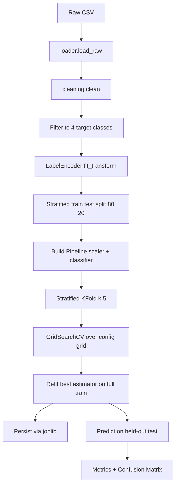

# ML Pipeline

End-to-end flow from raw CICIDS CSV to a saved model artifact.

## Sequence

## Why the scaler is inside the Pipeline

If you do this::

    X_train_scaled = scaler.fit_transform(X_train)
    X_test_scaled  = scaler.transform(X_test)
    cross_val_score(clf, X_train_scaled, y_train, cv=5)

…then inside each CV fold, the scaler was already fit on the *full* train
set — including the rows used as the validation fold. That's leakage.

The leak-proof shape is::

    pipe = Pipeline([("scaler", StandardScaler()),
                     ("clf",    RandomForestClassifier(...))])
    cross_val_score(pipe, X_train, y_train, cv=5)

Now `fit_transform` is called per fold, scaler statistics never see the
held-out fold. Same logic protects GridSearchCV.

## Class imbalance

Per-model strategy (config-controlled):

| Model | Default | Reason |
|-------|---------|--------|
| Logistic Regression | `class_weight='balanced'` | supported natively |
| Random Forest | `class_weight='balanced'` | supported natively |
| MLP | SMOTE via `imblearn.Pipeline` | MLP doesn't support `class_weight` |

## Hyperparameter tuning (Phase 7)

`GridSearchCV` over the `grid` block in `config.yaml`. Output:
- `best_estimator_` → `models/<name>_tuned.joblib`
- `cv_results_` → `results/metrics/<name>_cv_results.csv`
- summary row in `results/metrics/baseline_vs_tuned.csv`

## Reproducibility checklist

- [x] Single `RANDOM_STATE=42` constant
- [x] `seed_everything()` called in entry points
- [x] All estimators take `random_state=RANDOM_STATE`
- [x] Stratified splits everywhere
- [x] Pinned dependencies in `requirements.txt`
- [x] sklearn version recorded in saved model metadata (Phase 12)
